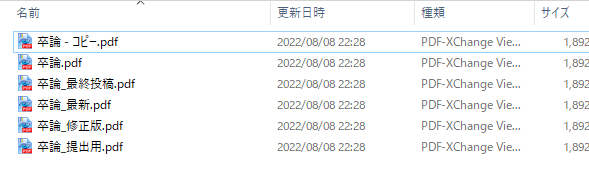
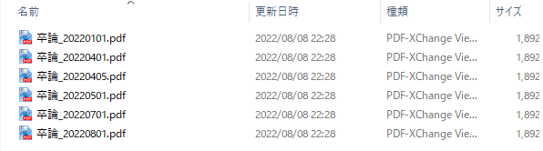
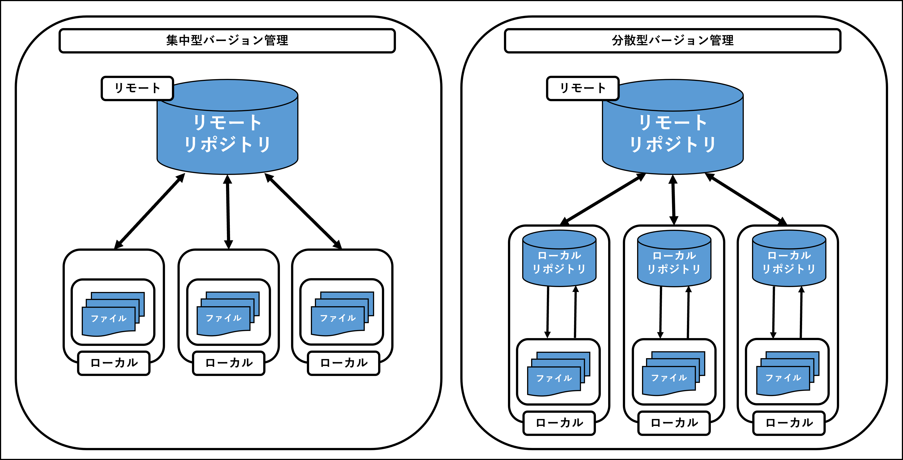
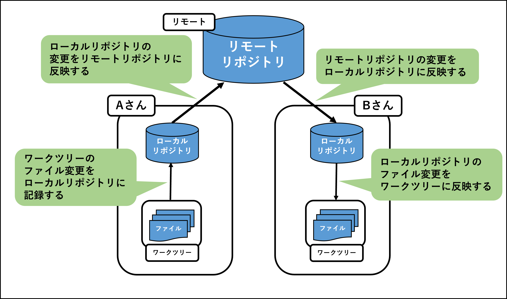
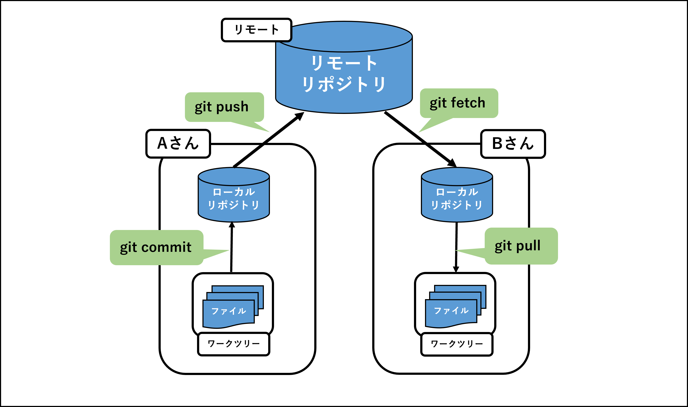

# Git基礎編

# Gitとは

Gitは、分散型**バージョン管理システム(Version Control Systems)** の1つです。（VCSと略されます）
ソースコードなどのファイル変更履歴を記録・追跡ができる。

# バージョン管理とは？
- `バージョン管理` とは、プロジェクト内で更新されていく、様々なファイルの変更履歴を記録すること。
- 従来のバージョン管理システムは、ファイルの変更履歴を差分保管していましたが、Gitはファイルのバージョンをスナップショットとして保存している。
- これにより、Gitは枝分かれした変更の統合（merge）が高速に行える。

# バージョン管理システムを導入する場面

以下の画像のようにファイルを手動で管理していたとします。

そうすると、「**最新がどれかわからない**」といった課題が発生します。
これはファイルを保存するときに**日付をファイル名に含める**という決まりを作ることで解決します。

しかし、この場合だと**新しい日付のバージョンが増えるたびに容量が加算**されていきます。
また、複数人で修正する場合、同じ個所を修正した際の対処を考えて管理しなくてはいけません。

**ファイル管理にこんなに悩みたくない！！**
そんな時にGitを始めとする **バージョン管理システム** を導入するのです。

# バージョン管理システムができること
- ファイルの変更履歴を複数人で共有する
- 複数人で修正した箇所を統合できる
- 変更履歴から過去のファイルに戻す
- 変更履歴の差分を確認する

など

バージョン管理システムは、ファイルのバージョン管理の複雑さを解決してくれます。

# バージョン管理システムの種類

- バージョン管理システムには、 `集中型バージョン管理` と `分散型バージョン管理` の2種類が存在する。
- 集中型バージョン管理では、 `Subversion（SVN）` や `Concurrent Versions System（CVS）` が有名。
- 分散型バージョン管理では、 `Git` や `Mercurial (マーキュリアル)` が有名。

# Git基礎

## Gitの基本的な動作

- 管理したいファイルのまとまりを `リポジトリ` という。
- Gitは、リポジトリがローカルとリモートに別れていることが特徴。
- Gitの基本操作は以下の通り

- Gitの基本操作をコマンドで表すと以下の通り

## 

Gitには `branch（ブランチ）` と `merge（マージ）` という概念が存在する。
別々の時間軸の修正をbranchと呼び、それらを統合することをmergeという

