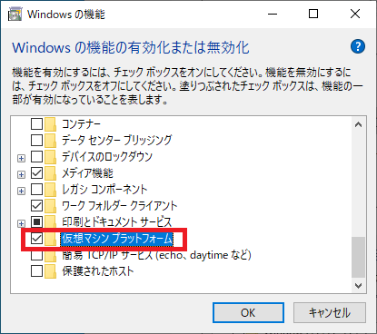

# wsl2にUbuntu環境を構築する

## BIOSの設定
1. BIOS画面に入る。
    - PCメーカー別
        - 富士通 ： `F2キー`
        - NEC ： `F2キー`
        - 東芝 ： `F2キー` または `ESCキー` を押しながら起動し、メーカーロゴが表示されたら `F1キー` を押下する
        - Lenovo（IBM） ： `F1キー`
        - HP（Compaq） ： `F10キー`
        - Dell ： `F2キー` または `Ctrl + Alt + Enter`
        - 日立 ： `F2キー`
        - Panasonic ： `F2キー`
        - Sharp ： `F2キー`
        - ASUS ： `F2キー`
        - ソニー ： `F2キー`
        - 自作PCまたはパソコンショップで購入したPCなど ： `Delete`
    - マザーボードメーカー別
        - ASUS ： `Delete`
        - Intel ： `F2キー`
        - Giga-byte ：  `Delete`
        - ESC ： `Delete`
        - ASROCK ：  `F2キー`
        - MSI ：  `Delete`
    - OS起動後からBIOSに入る
        1. スタートボタンを押下する
        2. 設定ボタンを押下する
        3. 更新とセキュリティを押下する
        4. 回復 > PCの起動をカスタマイズする > 今すぐPCを再起動する を押下する
        5. オプションの選択 > トラブルシューティング > 詳細オプション > UEFI ファームウェアの設定 を押下する
2. `Virtualization Technology` を `Enabled` に変更する。

## Windows の機能の有効化または無効化の設定
1. `Windows の機能の有効化または無効化` を開く。

2. `Hyper-V` , `Linux 用 Windows サブシステム` または `Windows Subsystem for Linux` , `仮想マシンプラットフォーム` を有効にする。


3. `OK` を押下する。
4. PCを再起動する。

以下コマンドでも設定ができる。

```cmd:コマンド
# 「Linux 用 Windows サブシステム」 または 「Windows Subsystem for Linux」 を有効
dism.exe /online /enable-feature /featurename:Microsoft-Windows-Subsystem-Linux /all /norestart

# 「仮想マシン プラットフォーム」 を有効
> dism.exe /online /enable-feature /featurename:VirtualMachinePlatform /all /norestart
```
```cmd:実行結果
> dism.exe /online /enable-feature /featurename:Microsoft-Windows-Subsystem-Linux /all /norestart

展開イメージのサービスと管理ツール
バージョン: 10.0.19041.844

イメージのバージョン: 10.0.19044.1826

機能を有効にしています
[==========================100.0%==========================]
操作は正常に完了しました。
> dism.exe /online /enable-feature /featurename:VirtualMachinePlatform /all /norestart

展開イメージのサービスと管理ツール
バージョン: 10.0.19041.844

イメージのバージョン: 10.0.19044.1826

機能を有効にしています
[==========================100.0%==========================]
操作は正常に完了しました。
```

## wsl2インストール

1.WSLバージョンを2に設定する
```cmd:コマンド
wsl --set-default-version 2
```
```cmd:実行結果
> wsl --set-default-version 2
WSL 2 との主な違いについては、https://aka.ms/wsl2 を参照してください
この操作を正しく終了しました。
```
2.使用可能な Linux ディストリビューションを一覧表示する
```cmd:コマンド
wsl --list --online
```
```cmd:実行結果
> wsl --list --online
インストールできる有効なディストリビューションの一覧を次に示します。
'wsl --install -d <Distro>' を使用してインストールします。

NAME            FRIENDLY NAME
Ubuntu          Ubuntu
Debian          Debian GNU/Linux
kali-linux      Kali Linux Rolling
openSUSE-42     openSUSE Leap 42
SLES-12         SUSE Linux Enterprise Server v12
Ubuntu-16.04    Ubuntu 16.04 LTS
Ubuntu-18.04    Ubuntu 18.04 LTS
Ubuntu-20.04    Ubuntu 20.04 LTS
```
3.Linux ディストリビューションをインストール
```cmd:コマンド
wsl --install -d Ubuntu
```
```cmd:実行結果
> wsl --install -d Ubuntu
ダウンロード中: Ubuntu
インストール中: Ubuntu
Ubuntu はインストールされました。
Ubuntu を起動しています...
```
4.`ubuntu` を起動する。
    - 初回起動時は `ユーザ名` と `パスワード` を入力する。

```cmd:実行結果
Installing, this may take a few minutes...
Please create a default UNIX user account. The username does not need to match your Windows username.
For more information visit: https://aka.ms/wslusers
Enter new UNIX username: 【ユーザ名】
New password:【パスワード】
Retype new password:【パスワード】
passwd: password updated successfully
Installation successful!
To run a command as administrator (user "root"), use "sudo <command>".
See "man sudo_root" for details.

Welcome to Ubuntu 20.04 LTS (GNU/Linux 5.10.102.1-microsoft-standard-WSL2 x86_64)

 * Documentation:  https://help.ubuntu.com
 * Management:     https://landscape.canonical.com
 * Support:        https://ubuntu.com/advantage

  System information as of Mon Jul 25 22:56:43 JST 2022

  System load:  0.19               Processes:             8
  Usage of /:   0.4% of 250.98GB   Users logged in:       0
  Memory usage: 0%                 IPv4 address for eth0: 172.20.70.116
  Swap usage:   0%

0 updates can be installed immediately.
0 of these updates are security updates.


The list of available updates is more than a week old.
To check for new updates run: sudo apt update


This message is shown once once a day. To disable it please create the
/home/【ユーザ名】/.hushlogin file.
【ユーザ名】@【PC名】:~$
```
5.実行結果のように起動できれば成功。

## エラー時の対処
- `ubuntu` 起動時に以下のエラーが発生した場合


1.WSLを更新する。
```cmd:コマンド
wsl --update
```
2.WSLを再起動する。
```cmd:コマンド
wsl --shutdown
```

