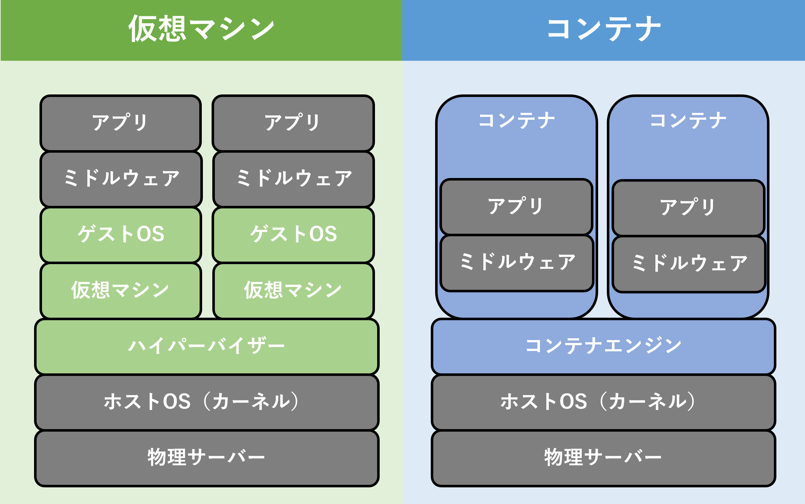
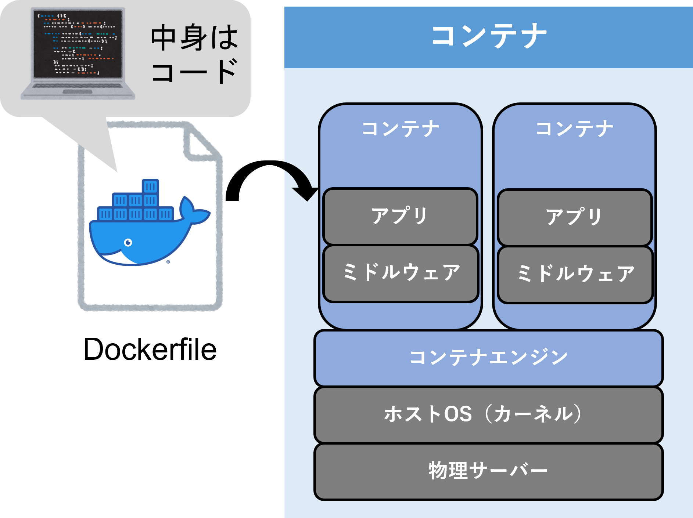

# Docker基礎

## Dockerとは
- Dockerとは、コンテナ型の仮想環境を作成、配布、実行するためのプラットフォーム。
- コンテナ型とは、ホストOSのカーネルを利用し、ゲストOSがあるかのように仮想環境を作り上げること。
- 従来の仮想マシンと比べて軽量で高速な仮想環境の起動と停止ができる。
- Dockerfileというコードからコンテナ作成が可能。




## Dockerのメリット

- どのコンピュータ上でも同じ環境を作れる
- 環境をコードで保持できるため再利用やバージョン管理、配布、一部修正等が簡単
- クラウド上に自動でサーバ構築できる
- DockerHubに公開されているコンテナイメージを誰でも利用できる
    - [Docker Hub](https://hub.docker.com)

## Docker基本コマンド

### Dockerバージョン確認コマンド
Dockerのバージョンを確認するコマンド。

- コマンド
```
docker -v
```

- 実行例
```
$ docker -v
Docker version 20.10.17, build 100c701
```

### Dockerイメージ作成コマンド
Dockerファイルからコンテナイメージを作成するコマンド。
※ Dockerfileが存在するパスに移動してコマンドを実行する。

- コマンド
```
docker build -t [コンテナイメージ名]:[タグ名] .
```

- 実行例
```
$ docker build -t ubuntu-ryome-test:1.0 .
Sending build context to Docker daemon  20.99kB
Step 1/5 : FROM ubuntu
 ---> df5de72bdb3b
Step 2/5 : USER root
 ---> Using cache
 ---> ebf1c14ce73a
Step 3/5 : RUN apt-get update
 ---> Using cache
 ---> 249a45a0e06f
Step 4/5 : RUN apt-get install -y vim
 ---> Using cache
 ---> 9f5a1b628f90
Step 5/5 : COPY test.txt /
 ---> 29416a0ce55d
Successfully built 29416a0ce55d
Successfully tagged ubuntu-ryome-test:1.0
$ docker images
REPOSITORY          TAG       IMAGE ID       CREATED         SIZE
ubuntu-ryome-test   1.0       29416a0ce55d   6 seconds ago   173MB
ubuntu              latest    df5de72bdb3b   2 weeks ago     77.8MB
```

### DockerHubからイメージ取得コマンド
[Docker Hub](https://hub.docker.com)からコンテナイメージを取得するコマンド。

- コマンド
```
docker pull [コンテナイメージ名]
```

- 実行例
```
$ docker pull mysql
Using default tag: latest
latest: Pulling from library/mysql
32c1bf40aba1: Pull complete
3ac22f3a638d: Pull complete
b1e7273ed05e: Pull complete
20be45a0c6ab: Pull complete
410a229693ff: Pull complete
1ce71e3a9b88: Pull complete
c93c823af05b: Pull complete
c6752c4d09c7: Pull complete
d7f2cfe3efcb: Pull complete
916f32cb0394: Pull complete
0d62a5f9a14f: Pull complete
Digest: sha256:ce2ae3bd3e9f001435c4671cf073d1d5ae55d138b16927268474fc54ba09ed79
Status: Downloaded newer image for mysql:latest
docker.io/library/mysql:latest
```

### コンテナイメージ確認コマンド
ローカル内のDockerイメージを確認する。

- コマンド
```
docker images
または
docker image ls
```

- 実行例
```
$ docker images
REPOSITORY   TAG       IMAGE ID       CREATED       SIZE
mysql        latest    7b94cda7ffc7   2 weeks ago   446MB
```

### コンテナイメージ削除コマンド
ローカル内のDockerイメージを削除する。

- コマンド
```
docker rmi [イメージID　または　REPOSITORY:TAG] // 通常削除
または
docker rmi [イメージID　または　REPOSITORY:TAG] -f // 強制削除
```

- 実行例
```
$ docker images
REPOSITORY   TAG       IMAGE ID       CREATED       SIZE
mysql        latest    7b94cda7ffc7   2 weeks ago   446MB
$ docker rmi 7b94cda7ffc7
Untagged: mysql:latest
Untagged: mysql@sha256:ce2ae3bd3e9f001435c4671cf073d1d5ae55d138b16927268474fc54ba09ed79
Deleted: sha256:7b94cda7ffc7c59b01668e63f48e0f4ee3d16b427cc0b846193b65db671e9fa2
Deleted: sha256:5941a477484b80a594761cb828f993b574a1ac2cd741300503209752f7790466
Deleted: sha256:dd778772db51bcd70db26f7b9ae996220eb337721328090a409d1ab7919fb887
Deleted: sha256:e94a7bdbca441b8d897023017cf70bdc1ba7bf8233f8da4800bb6e4ed49f14f6
Deleted: sha256:d7d110459a2ceb8a080a2bd7264c66d9cc8699242aa320d1b9cdcde872c050a3
Deleted: sha256:6e4a1a78cee71e12fce86c8610f0c8802144714b4673b7cc6878c5a23b58d134
Deleted: sha256:38dc91f8c75eb2f05ad01169fdbfab02602dc250f2731322692eac67c9b41f71
Deleted: sha256:5aa021ed35bcc6afdb63ce3a80bbe9f8995d168ed138cd83cc33dc7ec9ea6ee1
Deleted: sha256:10a7f83cd06f6add8176d92056feea4efd45165367e5ba6fd5077c79468b6fe4
Deleted: sha256:775289ef4a1150bcf8ccf7947134a092ef6d23fc78ab89f8f9feff7226768f40
Deleted: sha256:a4470052a15f553513f12f02c1e52c811280ef56463a6774dcbd5ffd47a07045
Deleted: sha256:cf4db719a36940c70d724cd9eaa2fccaf1f0174ba863ebb40f428eaf13da76cc
```

### コンテナ起動コマンド
コンテナイメージを起動するコマンド。

- コマンド
```
docker run --name [コンテナ名（任意）] -p ローカルポート番号:コンテナポート番号 -e [環境変数の設定] -d [コンテナイメージ名]:[タグ名]
```

- 実行例
```
$ docker run --name ryome-mysql-test -p 13306:3306 -e MYSQL_ROOT_PASSWORD=test12345678 -d mysql
[コンテナID]
```

### コンテナ確認コマンド
コンテナを確認するコマンド。

- コマンド
```
docker ps // 起動中コンテナ確認
docker ps -a // 全てのコンテナ確認
```

- 実行例
```
$ docker ps
CONTAINER ID   IMAGE     COMMAND                  CREATED              STATUS              PORTS                                                    NAMES
3ea30b71fe68   mysql     "docker-entrypoint.s…"   About a minute ago   Up About a minute   33060/tcp, 0.0.0.0:13306->3306/tcp, :::13306->3306/tcp   ryome-mysql-test
```

### 起動中のコンテナ操作コマンド
起動中のコンテナでコマンドを実行するコマンド。
※ コンテナから抜ける場合は `Ctrl+P → Ctrl+Q ` または `ctrl + Q`

- コマンド
```
docker exec -it [コンテナ名] bash
```

- 実行例
```
$ docker exec -it ryome-mysql-test bash
bash-4.4# mysql -u root -p
Enter password:
Welcome to the MySQL monitor.  Commands end with ; or \g.
Your MySQL connection id is 8
Server version: 8.0.30 MySQL Community Server - GPL

Copyright (c) 2000, 2022, Oracle and/or its affiliates.

Oracle is a registered trademark of Oracle Corporation and/or its
affiliates. Other names may be trademarks of their respective
owners.

Type 'help;' or '\h' for help. Type '\c' to clear the current input statement.

mysql> create database testdb;
Query OK, 1 row affected (0.00 sec)

mysql> use testdb
Database changed
mysql> create table test(
    -> id int auto_increment not null primary key
    -> );
Query OK, 0 rows affected (0.03 sec)

mysql> insert into test(id) values(1)
    -> ;
Query OK, 1 row affected (0.01 sec)

mysql> select * from test;
+----+
| id |
+----+
|  1 |
+----+
1 row in set (0.00 sec)

mysql> exit
Bye
bash-4.4# read escape sequence
```

### 起動中のコンテナ停止コマンド
起動中のコンテナを停止するコマンド。

- コマンド
```
docker stop [コンテナ名]
```

- 実行例
```
$ docker stop ryome-mysql-test
ryome-mysql-test
$ docker ps
CONTAINER ID   IMAGE     COMMAND   CREATED   STATUS    PORTS     NAMES
```

### 停止中のコンテナ起動コマンド
停止中のコンテナを起動するコマンド。

- コマンド
```
docker start [コンテナ名]
```

- 実行例
```
$ docker start ryome-mysql-test
ryome-mysql-test
$ docker ps
CONTAINER ID   IMAGE     COMMAND                  CREATED          STATUS          PORTS                                                    NAMES
3ea30b71fe68   mysql     "docker-entrypoint.s…"   59 minutes ago   Up 11 seconds   33060/tcp, 0.0.0.0:13306->3306/tcp, :::13306->3306/tcp   ryome-mysql-test
```

### コンテナ削除コマンド
コンテナを削除するコマンド。

- コマンド
```
docker rm [コンテナ名] // 通常削除
または
docker rm [コンテナ名] -f // 強制削除
```

- 実行例
```
$ docker rm ryome-mysql-test
ryome-mysql-test
$ docker ps -a
CONTAINER ID   IMAGE     COMMAND   CREATED   STATUS    PORTS     NAMES
```

### コンテナからコンテナイメージ作成コマンド
コンテナからコンテナイメージを作成するコマンド。

- コマンド
```
docker commit [対象コンテナ名] [コンテナイメージ名]:[タグ名]
```

- 実行例
```
$ docker ps
CONTAINER ID   IMAGE                       COMMAND                  CREATED          STATUS          PORTS
    NAMES
90d7efca333e   postgres:14                 "docker-entrypoint.s…"   39 minutes ago   Up 39 minutes   0.0.0.0:15432->5432/tcp, :::15432->5432/tcp         test-postgres
$ docker commit test-postgres testdb:1.0
sha256:c7dc9e27ec1f721c9fce1e3759cda55c692406f594fa60e404b3cbd217aa82f5
$ docker images
REPOSITORY                  TAG            IMAGE ID       CREATED          SIZE
testdb                      1.0            c7dc9e27ec1f   6 seconds ago    376MB
```

## エラー解消方法

### `docker rmi` コマンドによるエラー

- エラー文

```
Error response from daemon: conflict: unable to delete [コンテナイメージID] (cannot be forced) - image has dependent child images
```

- 原因
  - 削除対象のIMAGE IDが複数存在する。
  - イメージには依存する子イメージが存在する。

- 対処
  - DockerイメージをREPOSITRY:TAG指定で削除する。
  - 子イメージを削除する。

## wsl2のUbuntuを使用してDockerコマンド実行時にエラーが出た場合
以下のエラーが発生した場合、Docker再起動を行う。

```
Cannot connect to the Docker daemon at unix:///var/run/docker.sock. Is the docker daemon running?
```

### Docker再起動
- コマンド
```
service docker stop // Docker停止
service docker start // Docker開始
```

- 実行結果
```
$ sudo service docker stop
 * Docker already stopped - file /var/run/docker-ssd.pid not found.
$ sudo service docker start
 * Starting Docker: docker
```


