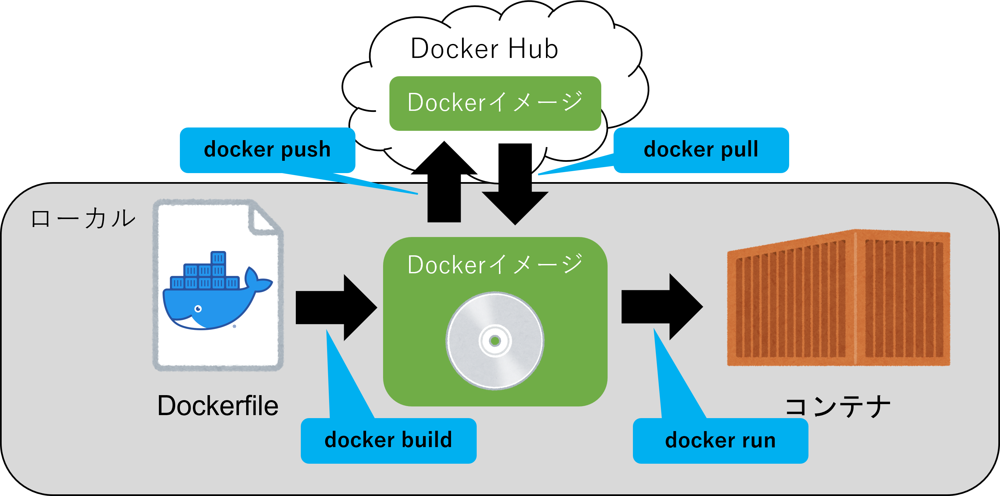

# Dockerfile基礎

## Dockerfileとは
- Dockerfileとは、コンテナイメージを作成するためのファイル。
- コンテナを作成する際にベースになる環境や実行するコマンド、配置するファイル等が記載されている。
- Dockerfileで作成したDockerイメージを[Docker Hub](https://hub.docker.com)に投稿することなども可能。



## Dockerfile作成
- `FROM`：ベースとなるイメージ
- `USER`：ユーザ名を変更
- `RUN`：実行するコマンド
- `ENTRYPOINT`：shの実行
- `ENV`:環境変数を設定
- `WORKDIR`：作業ディレクトリを追加
- `COPY`：コンテナにファイルをコピー（リモートも不可、圧縮が解凍されない）
- `ADD`：コンテナにファイルを追加する（リモートも可能、圧縮が解凍される）
- `コメント`：「#」以降の文章はコメントアウトされる

**テンプレート**
```
FROM [コンテナイメージ名]:[タグ名]
USER [ユーザ名]
RUN [コマンド] && [コマンド]...
ENTRYPOINT ["[実行ファイル]", "[パラメータ1]", "[パラメータ2]"... ]
ENV [環境変数名]=[環境変数値]
WORKDIR [作業ディレクトリパス]
COPY [コピー元ファイルパス] [コンテナ上のコピー先ファイルパス]
ADD [コピー元ファイルパス] [コンテナ上のコピー先ファイルパス]
```

**サンプル（書き方例）**
```Dockerfile
# ベースイメージをUbuntuにする
FROM ubuntu
# ユーザをrootにする
USER root
# インストール可能なパッケージを更新する
RUN apt-get update
# vimをインストール
RUN apt-get install -y vim
# test.txtをコピー
COPY test.txt /
```

## Dockerfileからコンテナ作成
サンプルのDockerfileを作成し、以下のコマンドを実行する。

- コマンド
```
docker build -t [コンテナイメージ名]:[タグ名] .
docker images
docker run --name [コンテナ名（任意）] -p ローカルポート番号:コンテナポート番号 -e [環境変数の設定] -d [コンテナイメージ名]:[タグ名]
docker ps
docker exec -it [コンテナ名] bash
```

- 実行例
```
$ docker build -t ubuntu-ryome-test:1.0 .
Sending build context to Docker daemon  20.99kB
Step 1/5 : FROM ubuntu
 ---> df5de72bdb3b
Step 2/5 : USER root
 ---> Using cache
 ---> ebf1c14ce73a
Step 3/5 : RUN apt-get update
 ---> Using cache
 ---> 249a45a0e06f
Step 4/5 : RUN apt-get install -y vim
 ---> Using cache
 ---> 9f5a1b628f90
Step 5/5 : COPY test.txt /
 ---> 29416a0ce55d
Successfully built 29416a0ce55d
Successfully tagged ubuntu-ryome-test:1.0
$ docker images
REPOSITORY          TAG       IMAGE ID       CREATED         SIZE
ubuntu-ryome-test   1.0       29416a0ce55d   6 seconds ago   173MB
ubuntu              latest    df5de72bdb3b   2 weeks ago     77.8MB
$ docker run --name ubuntu-test -it -d ubuntu-ryome-test:1.0
3b6536d4ac20be2b89d202e57a277ab7357ca31533e23de8218f29c80558042f
$ docker ps
CONTAINER ID   IMAGE                   COMMAND   CREATED          STATUS          PORTS     NAMES
3b6536d4ac20   ubuntu-ryome-test:1.0   "bash"    12 minutes ago   Up 12 minutes             ubuntu-test
$ docker exec -it ubuntu-test bash
root@3b6536d4ac20:/# ls
bin  boot  dev  etc  home  lib  lib32  lib64  libx32  media  mnt  opt  proc  root  run  sbin  srv  sys  test.txt  tmp  usr  var
root@3b6536d4ac20:/# cat test.txt
test
root@3b6536d4ac20:/#
```

## GitHub

GitHubにソースコードを公開しています。


