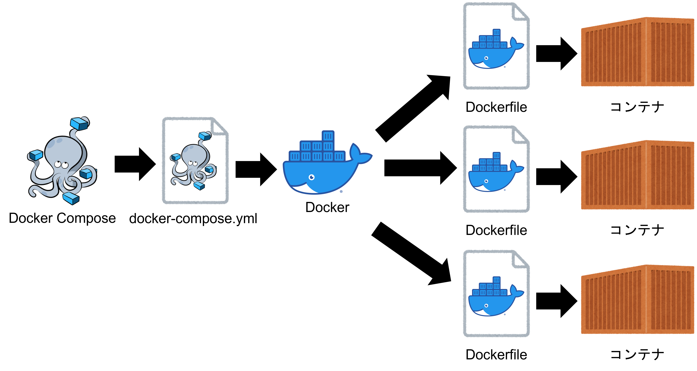

# Docker-compose基礎

## Docker-composeとは
- Docker-composeとは、複数のコンテナを定義し実行する Dockerアプリケーションのためのツール。
- Docker-composeは、YAMLファイルを使ってDockerコンテナの起動やコンテナ起動時の設定などを行うことができる。



## Docker-composeのメリット
- 複数のDockerfileを同時に起動できる。
- 実行コマンドによる環境差異がなくなる。（ポートやバージョンなど）
- ブリッジ・ネットワークが自動で作成されるため、コンテナ同士の通信が可能。
- インフラ構成の可視化やバージョン管理がDocker-composeで完結する。

## docker-compose.yml基礎

- `docker-compose.yml` の書き方

```
version: "バージョン値"
services:
  コンテナ名:
    image: "イメージ名"
    ports:
      - "ホスト側のポート:コンテナのポート"
    volumes:
      - ホスト側のパス:コンテナのパス
    environment:
      環境変数名: 環境変数値
  コンテナ名:
    build: Dockerfileのパス 
    ports:
      - "ホスト側のポート:コンテナのポート"
    volumes:
      - ホスト側のパス:コンテナのパス
    environment:
      環境変数名: 環境変数値
    depends_on:
      - コンテナ名
```

- `docker-compose.yml` の例

```
version: '3'                                                        ── 1 
services:                                                           ── 2 
  db:                                                               ── 3
    image: mysql:8.0                                                ── 4
    command: --default-authentication-plugin=mysql_native_password  ── 5
    volumes:                                                        ── 6
      - ./src/db/mysql_data:/var/lib/mysql
    environment:                                                    ── 7
      MYSQL_ROOT_PASSWORD: password
      MYSQL_PORT: 3306
    ports:                                                          ── 9
      - 3306:3306
  web:
    build: .                                                        ── 8
    command: bundle exec rails s -p 3000 -b '0.0.0.0'               ── 5
    volumes:                                                        ── 6
      - ./src:/app
    ports:                                                          ── 9
      - "3000:3000"
    environment:                                                    ── 7
      RAILS_ENV: development
    depends_on:                                                     ── 10
      - db
```

**説明** 
1.  version ········· docker-compose.yml で使用するバージョンを指定する。
2.  services ········ 起動するサービス群。ネストした要素でコンテナを定義する。
3.  コンテナ名 ···· 任意の名前（例：mysample、busybox） 
4.  image ··········· イメージからコンテナ生成する場合、イメージ（リポジトリ:タグ）を指定する
5.  command······· コンテナ起動時に実行するコマンドを設定する。
6.  volumes········· ローカルとコンテナでファイルを同期する
7.  environment··· 環境変数を設定する
8.  build ············· Dockerfileのディレクトリを指定する
9.  ports ············· ポート転送を指定する
10. depends_on···· 依存関係を設定する


## Docker-compose基本コマンド
- Docker-composeコマンドはカレントディレクトリに `docker-compose.yml` がある階層で行う。

### サービスイメージ確認
サービスイメージを確認する。

- コマンド
```
docker-compose images
```

- 実行例
```
$ docker-compose images
   Container         Repository      Tag       Image Id       Size
--------------------------------------------------------------------
test-java_java_1   test-java_java   latest   ee54c72bc25c   441.5 MB
```

### サービスイメージ作成
サービスのビルドを実行します。
ymlファイルに `image:` が書かれている場合はそのイメージ名がローカルになければ、リモートからプルしてきます。
`image:` が書かれていない場合、buildに書かれているパスのDockerfileでコンテナイメージを構築します。

- コマンド
```
docker-compose build
```

- 実行例
```
$ sudo docker-compose build
db uses an image, skipping
Building web
Sending build context to Docker daemon  286.9MB
...省略
```

### リモートからサービスイメージ取得
リモートからコンテナイメージを取得します。

- コマンド
```
docker-compose pull
```

- 実行例
```
$ docker-compose pull
Pulling db  ... done
Pulling web ... done
```

### リモートにサービスイメージ送信
リモートにコンテナイメージを送信します。

- コマンド
```
docker-compose push [サービス名]
```

- 実行例
```
```

### サービス確認
サービスの一覧を表示します。

- コマンド
```
docker-compose ps
```

- 実行例
```
$ docker-compose ps
           Name                         Command               State          Ports
-----------------------------------------------------------------------------------------
rails-docker-kyt-main_db_1   docker-entrypoint.sh --def ...   Up      3306/tcp, 33060/tcp
```

### サービス作成
構築されたサービスイメージからサービスを作ります。
作成されたサービスは停止状態です。

- コマンド
```
docker-compose create
```

- 実行例
```
$ docker-compose create
WARNING: The create command is deprecated. Use the up command with the --no-start flag instead.
rails-docker-kyt-main_db_1 is up-to-date
Creating rails-docker-kyt-main_web_1 ... done
$ docker-compose ps
           Name                          Command               State           Ports
-------------------------------------------------------------------------------------------
rails-docker-kyt-main_db_1    docker-entrypoint.sh --def ...   Up       3306/tcp, 33060/tcp
rails-docker-kyt-main_web_1   bundle exec rails s -p 300 ...   Exit 0
```

### サービス実行
サービスを作成して、起動します。
オプションで `-d` をつけることでバックグラウンドで実行することができます。
またオプションで `--build` をつけることで起動前にイメージも構築します。

- コマンド
```
docker-compose up
```

- 実行例
```$ docker-compose up -d
Creating network "test-java_default" with the default driver
Creating test-java_java_1 ... done
$ docker-compose images
   Container         Repository      Tag       Image Id       Size
--------------------------------------------------------------------
test-java_java_1   test-java_java   latest   ee54c72bc25c   441.5 MB
```

### サービス起動
停止中のサービスを起動します。

- コマンド
```
docker-compose start
```

- 実行例
```
$ docker-compose start
Starting db  ... done
Starting web ... failed
$ docker-compose ps
           Name                         Command               State          Ports
-----------------------------------------------------------------------------------------
rails-docker-kyt-main_db_1   docker-entrypoint.sh --def ...   Up      3306/tcp, 33060/tcp
```

### サービス停止
起動中のサービスを停止します。

- コマンド
```
docker-compose stop
```

- 実行例
```
$ docker-compose stop
Stopping rails-docker-kyt-main_db_1 ... done
$ docker-compose ps
           Name                         Command               State    Ports
----------------------------------------------------------------------------
rails-docker-kyt-main_db_1   docker-entrypoint.sh --def ...   Exit 0
```

### サービス停止・削除
docker-compose.ymlに書かれているサービスからコンテナを停止し、そのコンテナとネットワークを削除します。
オプションで `--rmi all` をつけることでイメージも削除してくれます。

- コマンド
```
docker-compose down
```

- 実行例
```
$ docker-compose down
Stopping rails-docker-kyt-main_db_1 ... done
Removing rails-docker-kyt-main_web_run_164360b21007 ... done
Removing rails-docker-kyt-main_db_1                 ... done
Removing network rails-docker-kyt-main_default
$ docker-compose ps
Name   Command   State   Ports
------------------------------
$ docker-compose images
Container   Repository   Tag   Image Id   Size
----------------------------------------------
```

### サービス強制削除
停止中のコンテナを削除します。

- コマンド
```
docker-compose rm
```

- 実行例
```
$ docker-compose rm
Going to remove rails-docker-kyt-main_web_1, rails-docker-kyt-main_web_run_7e07fbbec5b8, rails-docker-kyt-main_web_run_1194ea0ee54c, rails-docker-kyt-main_web_run_7ff1e8799711, rails-docker-kyt-main_web_run_9a6a99846df2
Are you sure? [yN] y
Removing rails-docker-kyt-main_web_1                ... done
Removing rails-docker-kyt-main_web_run_7e07fbbec5b8 ... done
Removing rails-docker-kyt-main_web_run_1194ea0ee54c ... done
Removing rails-docker-kyt-main_web_run_7ff1e8799711 ... done
Removing rails-docker-kyt-main_web_run_9a6a99846df2 ... done
$ docker-compose ps
           Name                         Command               State          Ports
-----------------------------------------------------------------------------------------
rails-docker-kyt-main_db_1   docker-entrypoint.sh --def ...   Up      3306/tcp, 33060/tcp
```

### サービス強制消去
サービスを強制停止します。

- コマンド
```
docker-compose kill
```

- 実行例
```
$ docker-compose kill
Killing rails-docker-kyt-main_db_1 ... done
$ docker-compose ps
           Name                         Command                State     Ports
------------------------------------------------------------------------------
rails-docker-kyt-main_db_1   docker-entrypoint.sh --def ...   Exit 137
```

### サービスでコマンド実行
引数で指定したサービスのコンテナ内でコマンドを実行します。

- コマンド
```
docker-compose run [サービス名] [コマンド] [引数...]
```

- 実行例
```
$ docker-compose run web rails new . --force --database=mysql
Creating network "rails-docker-kyt-main_default" with the default driver
Pulling db (mysql:8.0)...
8.0: Pulling from library/mysql
918cd2ecf4de: Pull complete
0e09c69f9ec2: Pull complete
...省略
```

### サービス内でコマンド実行
引数にサービス名を指定してコンテナ内に入ってコマンドを実行します。

- コマンド
```
docker-compose exec [サービス名] /bin/bash
```

- 実行例
```
$ docker-compose exec java bash
root@b6cfe5f176f6:/usr/src# javac Main.java
root@b6cfe5f176f6:/usr/src# java Main
Hello World!
root@b6cfe5f176f6:/usr/src# read escape sequence
```

### サービス再起動
サービスを再起動します。

- コマンド
```
docker-compose restart
```

- 実行例
```
$ docker-compose restart
Restarting test-java_java_1 ... done
$ docker-compose ps
      Name         Command   State                    Ports
-----------------------------------------------------------------------------
test-java_java_1   jshell    Up      0.0.0.0:8080->8080/tcp,:::8080->8080/tcp
```

### サービス設定確認
docker-compose.ymlで書かれてる内容が表示されます。

- コマンド
```
docker-compose config
```

- 実行例
```
$ docker-compose config
services:
  java:
    build:
      context: /home/【ユーザ名】/docker/test-java/docker/java
    ports:
    - published: 8080
      target: 8080
    tty: true
    volumes:
    - /home/【ユーザ名】/docker/test-java/server/src:/usr/src:cached
version: '3.6'
```

### サービスログ確認
サービスのログを出力します。

- コマンド
```
docker-compose logs
```

- 実行例
```
$ docker-compose logs
Attaching to test-java_java_1
java_1  | Aug 27, 2022 7:05:19 AM java.util.prefs.FileSystemPreferences$1 run
java_1  | INFO: Created user preferences directory.
java_1  | |  Welcome to JShell -- Version 11.0.16
java_1  | |  For an introduction type: /help intro
java_1  | >....|  Welcome to JShell -- Version 11.0.16
java_1  | |  For an introduction type: /help intro
```

## 参考文献
- ブログ
[docker-compose コマンドまとめ](https://qiita.com/wasanx25/items/d47caf37b79e855af95f)
- 動画
[【Docker超入門 #7】Docker ComposeでRailsを構築しよう](https://www.youtube.com/watch?v=ltDdZAJli8c&list=PLob_wWxEUuNURSkNrSNYATagpJ5dfwm9r&index=7&t=154s)
