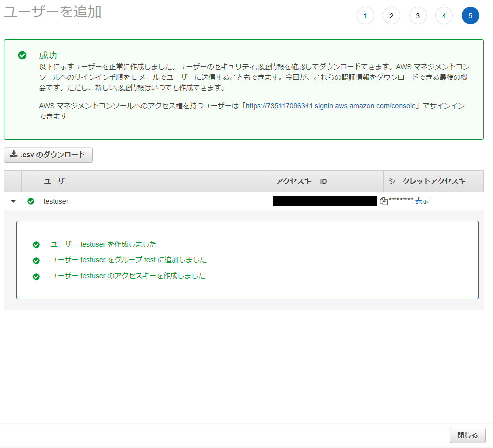

# UbuntuにAWSCLIをインストールする

## AWS CLI のインストール

1. パッケージをアップデートする
- コマンド
```
sudo apt-get update
```

- 実行例
```
$ sudo apt-get update
[sudo] password for ユーザ名:
Hit:1 http://archive.ubuntu.com/ubuntu focal InRelease
...省略
```

2. 必要なパッケージをインストールする
- コマンド
```
sudo apt install unzip
sudo apt install curl
```

- 実行例
```
$ sudo apt install unzip
Reading package lists... Done
Building dependency tree
Reading state information... Done
...省略
$ sudo apt install curl
Reading package lists... Done
Building dependency tree
...省略
```

3. AWS CLI をダウンロード
- コマンド
```
curl "https://awscli.amazonaws.com/awscli-exe-linux-x86_64.zip" -o "/tmp/awscliv2.zip"
```

- 実行例
```
$ curl "https://awscli.amazonaws.com/awscli-exe-linux-x86_64.zip" -o "/tmp/awscliv2.zip"
  % Total    % Received % Xferd  Average Speed   Time    Time     Time  Current
                                 Dload  Upload   Total   Spent    Left  Speed
100 44.8M  100 44.8M    0     0  21.2M      0  0:00:02  0:00:02 --:--:-- 21.2M
```

4. AWS CLI をインストール
- コマンド
```
unzip /tmp/awscliv2.zip -d /tmp/ && sudo /tmp/aws/install -i /usr/local/aws-cli -b /usr/local/bin
```

- 実行例
```
$ unzip /tmp/awscliv2.zip -d /tmp/ && sudo /tmp/aws/install -i /usr/local/aws-cli -b /usr/local/bin
Archive:  /tmp/awscliv2.zip
   creating: /tmp/aws/
   creating: /tmp/aws/dist/
...省略
```

5. zipファイル削除
- コマンド
```
rm /tmp/awscliv2.zip
```

- 実行例
```
$ ls /tmp/
aws  awscliv2.zip
$ rm /tmp/awscliv2.zip
$ ls /tmp/
aws
```

6. AWS CLI のバージョン確認
- コマンド
```
aws --version
```

- 実行例
```
$ aws --version
aws-cli/2.7.35 Python/3.9.11 Linux/5.10.102.1-microsoft-standard-WSL2 exe/x86_64.ubuntu.20 prompt/off
```

## AWS CLI の設定

1. AWSにログインする 

https://console.aws.amazon.com/

2. ユーザを追加する
   step1. `IAM > アクセス管理 > ユーザー > ユーザを追加`　を押下する

   

   

   step2. `ユーザ名` を入力し、`アクセスキー・プログラムによるアクセス` にチェックをチェックを付け `次のステップ` を押下する

   

   step3. `ユーザをグループに追加 > グループ作成` からグループを作成する。
      - グループは `AmazonECS_FullAccess` と `AmazonEC2FullAccess` 、 `AmazonEC2ContainerRegistryFullAccess` 、 `AmazonEC2ContainerRegistryPowerUser` にチェックを付ける
   step4. `アクセス権限の境界を設定せずにuserを作成する` にチェックをチェックを付け `次のステップ` を押下する

   

   

   

   

   

   

   step6. `キー`　と `値` を入力し、 `次のステップ` を押下する

   

   step6. `アクセスキーID`　と `シークレットアクセスキー` をメモする

<br>

3. AWS CLIオプションを設定する
- コマンド
```
aws configure
```

- 実行例
```
$ aws configure
AWS Access Key ID [None]: 【アクセスキーID】
AWS Secret Access Key [None]: 【シークレットアクセスキー】
Default region name [None]: ap-northeast-1
Default output format [None]: JSON
```

- 詳細
  - AWS Access Key ID [None]: アクセスキーID
  - AWS Secret Access Key [None]: シークレットアクセスキー
  - Default region name [None]: ap-northeast-1（Tokyoリージョン）
  - Default output format [None]: "text","JSON","table"のどれかを指定

## 参考文献
https://mytech-blog.com/ubuntu-aws-cli/

https://qiita.com/n0bisuke/items/1ea245318283fa118f4a


