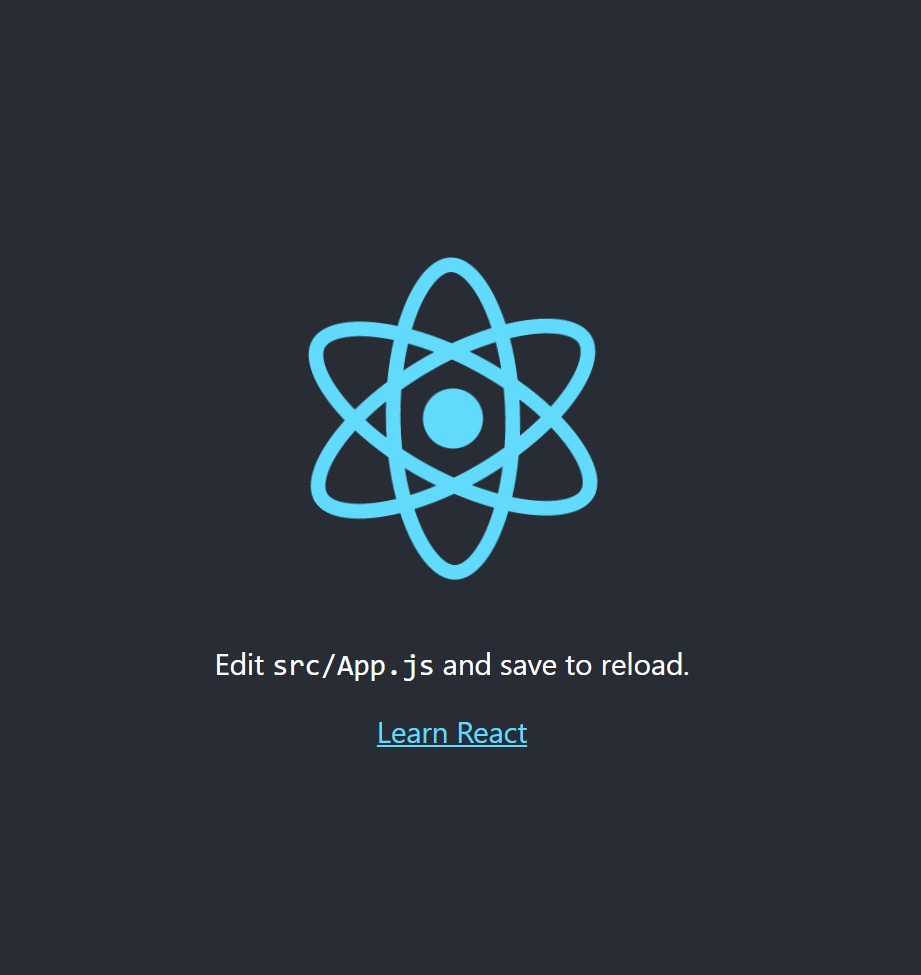

# React環境構築

## Node.jsインストール

### Windows
1. 以下のURLからインストーラーをダウンロードする。
    - [https://nodejs.org/ja/](https://nodejs.org/ja/)

2. インストーラーを起動し、インストールする。

3. コマンドプロンプ開き、以下コマンドを実行する
    ```
    node --version

    npm --version
    ```
4. バージョンが表示されれば成功


### Linux（Ubuntu）
- コマンド
```
# Node.jsをインストール
$ sudo apt-get update
$ sudo apt-get install nodejs npm

# Node.jsのバージョン確認
$ node -v
$ npm -v
```

- 実行例
```
$ sudo apt-get update
ヒット:1 http://jp.archive.ubuntu.com/ubuntu focal InRelease
...省略
$ sudo apt-get install nodejs npm
[sudo] password for ryome:
パッケージリストを読み込んでいます... 完了
依存関係ツリーを作成しています
状態情報を読み取っています... 完了
以下の追加パッケージがインストールされます:
...省略
$ node -v
v10.19.0
$ npm -v
6.14.4
```

### npmインストール時のエラー時の対処法

- エラー内容
```
$ npm -v
-bash: /mnt/c/Program Files/nodejs/npm: /bin/sh^M: bad interpreter: No such file or directory
```

- 対処法
以下のコマンドを実行
```
$ sudo rm -rf /usr/local/lib/node_modules
$ sudo rm -rf /Users/user_name/.nodebrew/node/v8.7.0/lib/node_modules/package_name
$ curl -fsSL https://deb.nodesource.com/setup_12.x | sudo -E bash -
$ sudo apt install -y nodejs
$ curl -0 -L http://npmjs.org/install.sh | sudo sh
$ echo 'PATH="$HOME/bin:$HOME/.local/bin:$PATH"' >> ~/.bashrc
$ source ~/.bashrc
$ npm -v
```

### Mac
- コマンド
```
# Homebrewインストール
$ /usr/bin/ruby -e "$(curl -fsSL https://raw.githubusercontent.com/Homebrew/install/master/install)"

# Node.jsをインストール
$ brew install node

# Node.jsのパスを通す
$ export PATH=/usr/local/opt/node/bin:$PATH
$ source ~/.bash_profile

# Node.jsのバージョン確認
$ node -v
$ npm -v
```
- 実行例
```

```


## Reactプロジェクト作成
1. プロジェクト作成
    コマンドプロンプ開き、以下コマンドを実行する
    - コマンド
    ```
    npx clear-npx-cache
    npm i create-react-app
    npx create-react-app 【プロジェクト名】
    ```
    - 実行例
    ```
    >npx clear-npx-cache
    npx: installed 1 in 1.535s
    >npm i create-react-app
    npm WARN deprecated tar@2.2.2: This version of tar is no longer supported, and will not receive security updates. Please upgrade asap.
    ...省略
    >npx create-react-app react-tmp

    Creating a new React app in 【プロジェクトパス】.
    ...省略
    Happy hacking!
    ```
2. プロジェクトを起動する
    コマンドプロンプ開き、以下コマンドを実行する
    - コマンド
    ```
    npm start
    ```
    - 実行例
    ```
    >npm start

    react-tmp@0.1.0 start 【プロジェクトパス】
    react-scripts start
    ```
3. ブラウザを開く
    - `http://localhost:3000` にアクセスする
        - [localhost:3000](http://localhost:3000/)
    - 初期ページが表示されれば成功
    


## プロジェクト構成解説

```
【プロジェクト名】
├─node_modules
│  └─...省略
├─public
│  ├─favicon.ico
│  ├─index.html
│  ├─logo192.png
│  ├─logo512.png
│  ├─manifest.json
│  └─robots.txt
├─src
│  ├─App.css
│  ├─App.js
│  ├─App.test.js
│  ├─index.css
│  ├─index.js
│  ├─logo.svg
│  ├─reportWebVitals.js
│  └─setupTests.js
├─.gitignore
├─package-lock.json
├─package.json
└─README.md
```
- フォルダ
  - `node_modules`： `package.json` で指定したライブラリ等がインストールされる。
  - `public`：静的ファイルフォルダ。
  - `src`：ソースコードフォルダ。
- ファイル
  - `.gitignore`：Gitで管理したくないファイルやディレクトリを指定するためのファイル。
  - `package-lock.json`：`npm install` コマンドの実行結果が保管される。
  - `package.json`：プロジェクトで使用するライブラリ等を定義する。
  - `README.md`：説明書。主に `npm` コマンドについて解説されている。


## エラー時の対処法

- エラー内容
```
You are running `create-react-app` 5.0.0, which is behind the latest release (5.0.1).

We no longer support global installation of Create React App.

Please remove any global installs with one of the following commands:
- npm uninstall -g create-react-app
- yarn global remove create-react-app

The latest instructions for creating a new app can be found here:
https://create-react-app.dev/docs/getting-started/
```

- 対処法
以下コマンドを実行
```
npm uninstall -g create-react-app
npx clear-npx-cache
npm i create-react-app
npx create-react-app@latest my-app
```

## 参考文献

https://qiita.com/righteous/items/e5448cb2e7e11ab7d477