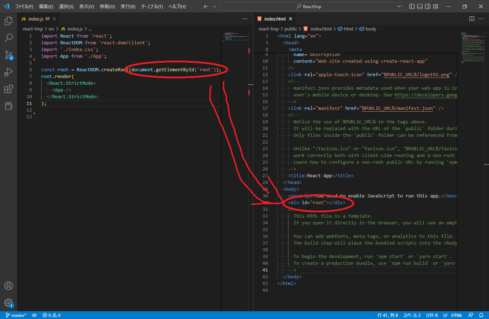
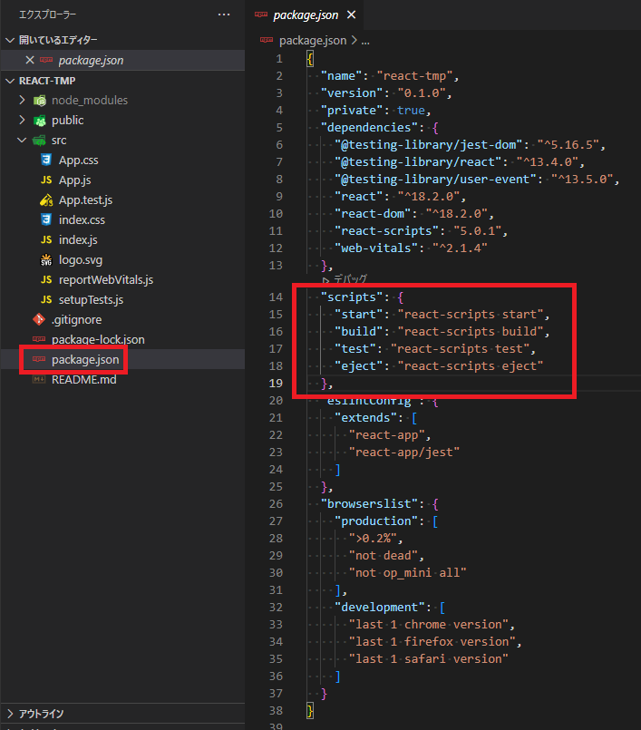

# React基礎

## Reactとは
- Reactは、Meta社（旧Facebook社）が作成したJavaScriptライブラリ
- Reactは、フレームワークではなく、UI（ユーザーインターフェース）の作成に特化したライブラリ
- Reactは、jQueryとは違い、データ更新とHTMLの書き換えを両方行う手間がかからない
- Reactは、データ更新時に、適切なコンポーネントだけを更新出来る（適切なコンポーネントを見つけるロジックを組まなくて良い）
- Reactは、JSX 記法(JavaScript内にHTMLを記述できる記法)を利用している
- Reactは、仮想 DOMとHTML上のDOMを比較し、その差分だけを更新するため拘束に動作する
- Reactのコンポーネントは、UIを構築するための部品のようなもので、コードの再利用性が高まる
- Reactには、 `クラスコンポーネント` と `関数コンポーネント` の2種類が存在する
- クラスコンポーネントは、React.Componentを継承したクラスによって定義される
- クラスコンポーネントは、stateやライフサイクルなどを最初から取得している
- 関数コンポーネントは、stateやライフサイクルなどを持たないコンポーネント
- ReactHooksを利用することで、関数コンポーネントでもstateやライフサイクルなどを取得できる
- クラスコンポーネントの場合は、stateを参照する時やメソッドを用いる時にthisを使う必要があり、コードも長くなる


## React初期プロジェクト説明
初期プロジェクトは以下のコマンドで作成できます。

- コマンド
```
npx create-react-app 【プロジェクト名】
```

- 実行例
```
>npx create-react-app react-tmp

Creating a new React app in C:\Users\【ユーザ名】\Desktop\ReactTmpApp\react-tmp.

Installing packages. This might take a couple of minutes.
Installing react, react-dom, and react-scripts with cra-template...
...省略
Happy hacking!
```




### ■ 起動方法

- `package.json > scripts` 内のコマンドについて解説します。
  - scripts内にはあらかじめコマンドを定義して `npm run 【コマンド名】` で実行できる
  - `start（react-scripts start）`: `npm run start` コマンドでReactを実行できる
  - `build（react-scripts build）`: `npm run build` コマンドでアプリケーションのビルドがプロジェクト内の `build/` フォルダに作成される
  - `test（react-scripts test）`: `npm run test` コマンドで
  - `eject（react-scripts eject）`: `npm run eject` コマンドで


## Reactの記述方法


## エラー対処

### npm test時のエラー対処
- エラー内容
```
>npm test

> react-tmp@0.1.0 test C:\Users\【ユーザ名】\Desktop\ReactTmpApp\react-tmp
> react-scripts test

Error: Failed to initialize watch plugin "node_modules/jest-watch-typeahead/filename.js":

  ● Test suite failed to run

    file:///C:/Users/【ユーザ名】/Desktop/ReactTmpApp/react-tmp/node_modules/jest-watch-typeahead/build/file_name_plugin/prompt.js:4
    import { PatternPrompt, printPatternCaret, printRestoredPatternCaret } from 'jest-watcher';
                            ^^^^^^^^^^^^^^^^^
    SyntaxError: Named export 'printPatternCaret' not found. The requested module 'jest-watcher' is a CommonJS module, which may not support all 
module.exports as named exports.
    CommonJS modules can always be imported via the default export, for example using:

    import pkg from 'jest-watcher';
    const { PatternPrompt, printPatternCaret, printRestoredPatternCaret } = pkg;

      at async requireOrImportModule (node_modules/jest-util/build/requireOrImportModule.js:65:32)
      at async watch (node_modules/@jest/core/build/watch.js:337:34)
      at async _run10000 (node_modules/@jest/core/build/cli/index.js:311:7)
      at async runCLI (node_modules/@jest/core/build/cli/index.js:173:3)

npm ERR! Test failed.  See above for more details.
```

- 対処法
以下コマンドを実行
```
npm i -D --exact jest-watch-typeahead@0.6.5
```

## 参考文献

https://tyotto-good.com/blog/reaseons-to-use-function-component

https://wk-partners.co.jp/homepage/blog/hpseisaku/javascript/react-start/

https://udemy.benesse.co.jp/development/app/react-beginner.html

https://qiita.com/TsutomuNakamura/items/72d8cf9f07a5a30be048

https://qiita.com/righteous/items/e5448cb2e7e11ab7d477

https://docs.npmjs.com/cli/v8/configuring-npm/package-json

https://qiita.com/ririli/items/d44389a30a6ea28d272f

https://qiita.com/mkurom/items/914abfeed61c35f58367

