# React Native環境構築

- **目次**
  - [1. Node.jsインストール](#1-nodejsインストール)
  - [2. ReactNativeインストール](#2-reactnativeインストール)
  - [3. Java11ダウンロード](#3-java11インストール)
  - [4. Android Studioインストール](#4-android-studioインストール)

## 1. Node.jsインストール
1. 以下のURLからインストーラーをダウンロードする。
    - [https://nodejs.org/ja/](https://nodejs.org/ja/)

2. インストーラーを起動し、インストールする。
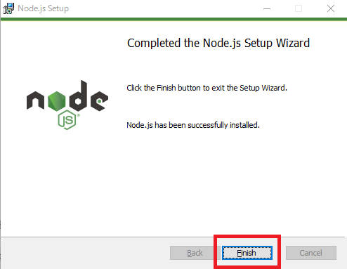
3. コマンドプロンプ開き、以下コマンドを実行する
```
node --version

npm --version
```
4. バージョンが表示されれば成功

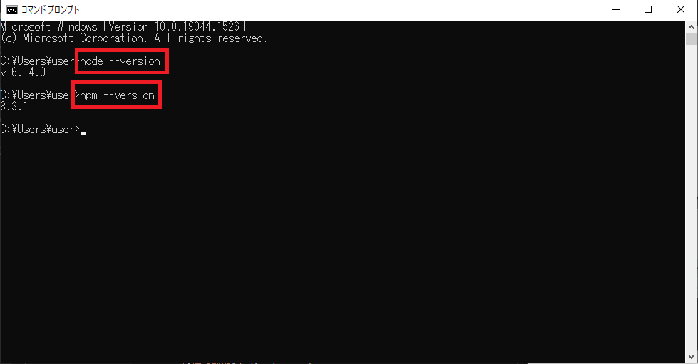

## 2. ReactNativeインストール
1. コマンドプロンプトを開き、以下コマンドを実行する
```
npm install -g react-native-cli

npx react-native -v
```
- 実行結果
```
C:\Users\ユーザ名>npm install -g react-native-cli
C:\Users\ユーザ名\AppData\Roaming\npm\react-native -> C:\Users\ユーザ名\AppData\Roaming\npm\node_modules\react-native-cli\index.js
+ react-native-cli@2.0.1
added 88 packages from 27 contributors in 6.872s
```
2. `npx react-native -v` コマンドでバージョンが表示されれば成功

## 3. Java11インストール
1. 以下のリンクからJava11をダウンロードする
    - [https://jdk.java.net/java-se-ri/11](https://jdk.java.net/java-se-ri/11)
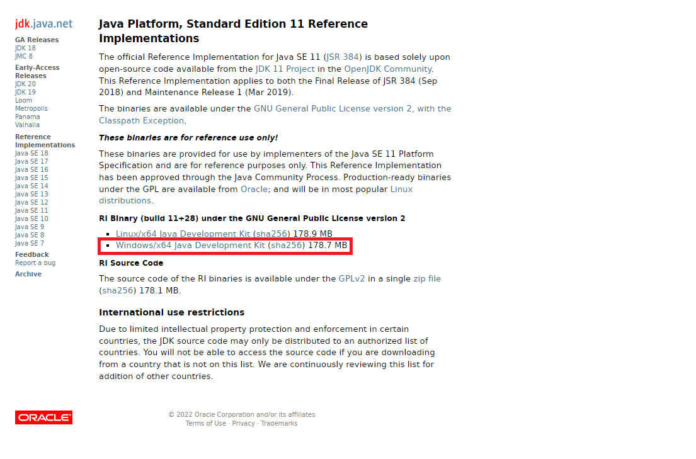
2. ダウンロードしたZIPファイル（`openjdk-11+28_windows-x64_bin.zip`）を展開し、`C:\Program Files\Java` 直下（任意）に配置する
3. システム環境変数を開く
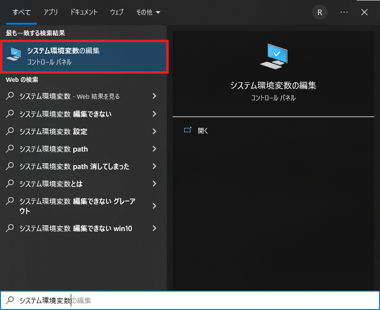
4. `環境変数(N)...` を押下する
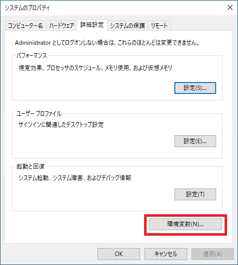
5. `新規(W)...` を押下し、変数名：`JAVA_HOME` 値：`展開したZIPファイルを配置したパス` を作成する
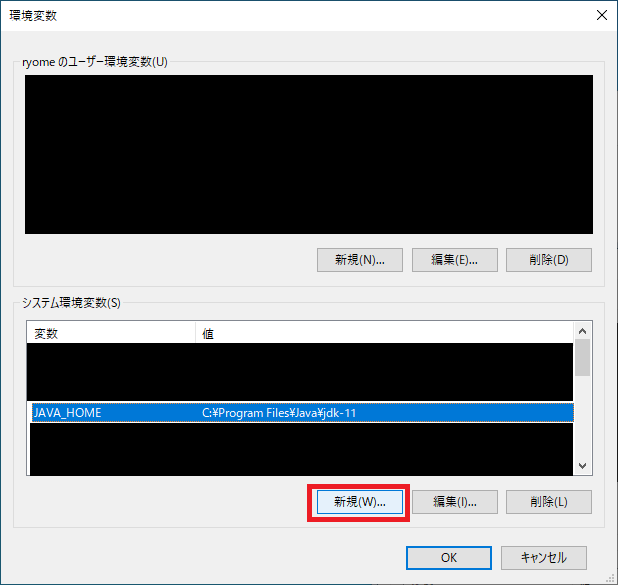
6. `Path` を選択し、`編集(I)...` を押下する
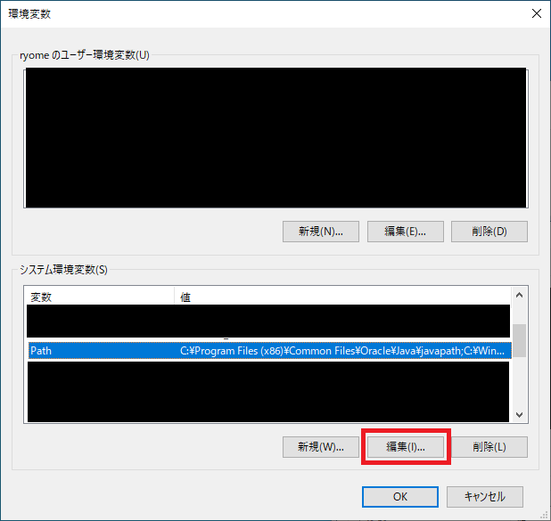
7. `新規(N)` を押下し、`%JAVA_HOME%\bin` を追加する
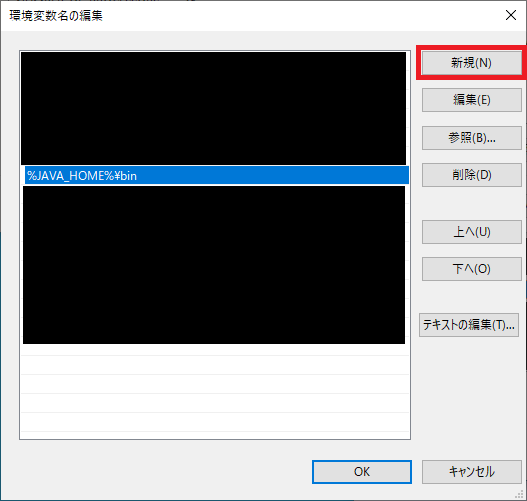
8. コマンドプロンプトを開き、以下コマンドを実行する
```
javac -version
```
9. バージョンが表示されれば成功
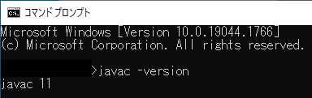

## 4. Android Studioインストール
1. 以下のURLからインストーラーをダウンロードする。
    - [https://developer.android.com/studio/index.html?hl=ja](https://developer.android.com/studio/index.html?hl=ja)
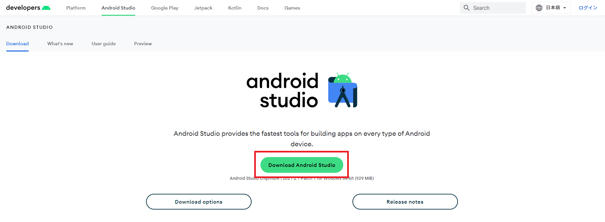
2. インストーラーを起動し、インストールする。
3. Android Studioの起動が確認できれば成功
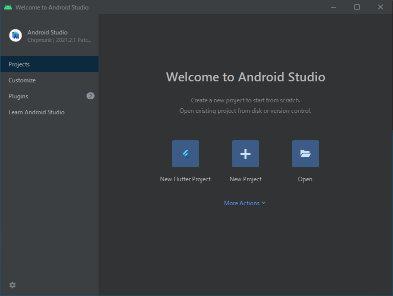
