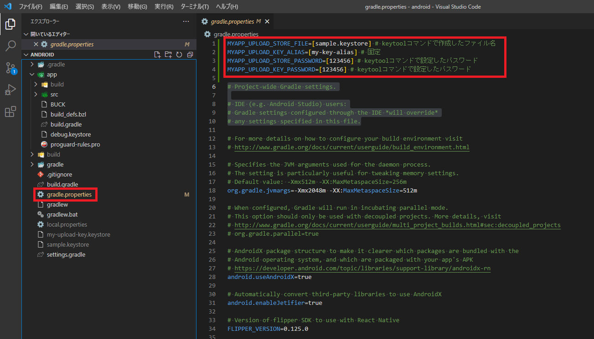
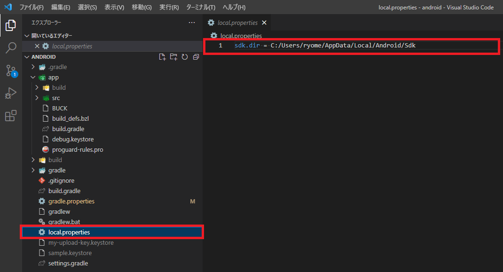
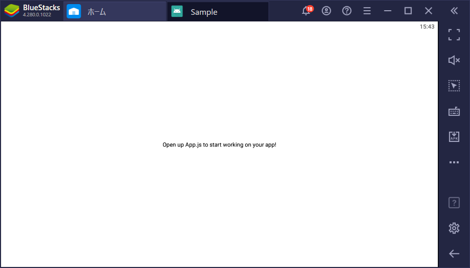

# React Nativeアプリをビルドする手順(Android)

**目次**
  - [5. ReactNativeプロジェクト作成](#5-reactnativeプロジェクト作成)
  - [6. keystore作成](#6-keystore作成)
  - [7. APKファイル作成](#7-apkファイル作成)
  - [8. 適当なエミュレータで動作確認](#8-適当なエミュレータで動作確認)


## 5. ReactNativeプロジェクト作成
1. コマンドプロンプトを開く
2. 任意のフォルダに移動してサンプルのプロジェクトを作成する
```
npx create-react-native-app プロジェクト名
```
3. 以下の文章が表示されタ場合、 `Enter` を押下する
```
npx: installed 1 in 1.307s
? How would you like to start » - Use arrow-keys. Return to submit.
>   Default new app
    Template from expo/examples: https://github.com/expo/examples
```
4. プロジェクト名のフォルダが作成されていれば成功
```
npx: installed 1 in 1.307s
√ How would you like to start » Default new app
√ Downloaded and extracted project files.

Using Yarn to install packages. You can pass --use-npm to use npm instead.

√ Installed JavaScript dependencies.
√ Skipped installing CocoaPods because operating system is not on macOS.

✅ Your project is ready!

To run your project, navigate to the directory and run one of the following yarn commands.

- cd Sample
- yarn android
- yarn ios # you need to use macOS to build the iOS project - use the Expo app if you need to do iOS development without a Mac
- yarn web
```

## 6. keystore作成
1. androidフォルダに移動する
```
cd 【プロジェクト名フォルダのパス】\android
```
2. 以下コマンドを実行する
```
keytool -genkeypair -v -storetype PKCS12 -keystore 【キーファイル名】.keystore -alias my-key-alias -keyalg RSA -keysize 2048 -validity 10000
```
3. 以下の通り値を入力する
- `キーストアのパスワードを入力してください:`
    - 6文字以上で任意の文字列
- `新規パスワードを再入力してください:`
    - 先ほど入力したパスワード
- `姓名は何ですか。`
    - 任意の文字列
- `組織単位名は何ですか。`
    - 任意の文字列
- `組織名は何ですか。`
    - 任意の文字列
- `都市名または地域名は何ですか。`
    - 任意の文字列
- `都道府県名または州名は何ですか。`
    - 任意の文字列
- `この単位に該当する2文字の国コードは何ですか。`
    - jp（任意）
- `CN=【入力した姓名】, OU=【入力した組織単位名】, O=【入力した組織名】, L=【入力した都市名または地域名】, ST=【入力した都道府県名または州名】, C=【入力した2文字の国コード】でよろしいですか。`
    - 内容が正しければ `y` 、正しくなければ `Enter` で修正できる。
```
【入力例】

キーストアのパスワードを入力してください:
新規パスワードを再入力してください:
姓名は何ですか。
  [Unknown]:  hogehoge
組織単位名は何ですか。
  [Unknown]:  fugafuga
組織名は何ですか。
  [Unknown]:  hogefuga
都市名または地域名は何ですか。
  [Unknown]:  hoge
都道府県名または州名は何ですか。
  [Unknown]:  fuga
この単位に該当する2文字の国コードは何ですか。
  [Unknown]:  jp
CN=hogehoge, OU=fugafuga, O=hogefuga, L=hoge, ST=fuga, C=jpでよろしいですか。
  [いいえ]:  y
```
4. 以下の文章が表示されれば成功
```
10,000日間有効な2,048ビットのRSAの鍵ペアと自己署名型証明書(SHA256withRSA)を生成しています
        ディレクトリ名: CN=hogehoge, OU=hoge, O=fuga, L=hogefuga, ST=fugahoge, C=jp
[【キーファイル名】.keystoreを格納中]
```

## 7. APKファイル作成
1. `【プロジェクト名フォルダのパス】/android/gradle.properties` の先頭に以下を追加する
```
MYAPP_UPLOAD_STORE_FILE=[sample.keystore] # keytoolコマンドで作成したファイル名
MYAPP_UPLOAD_KEY_ALIAS=[my-key-alias] # 固定
MYAPP_UPLOAD_STORE_PASSWORD=[123456] # keytoolコマンドで設定したパスワード
MYAPP_UPLOAD_KEY_PASSWORD=[123456] # keytoolコマンドで設定したパスワード
```

2. `【プロジェクト名フォルダのパス】/android/` に `local.properties` ファイルを作成する
```properties:local.properties
sdk.dir = C:/Users/【ユーザ名】/AppData/Local/Android/Sdk
```

3. コマンドプロンプトで以下コマンドを実行する
```
gradlew bundleRelease
```
4. 以下の文章が表示されることを確認する
```
BUILD SUCCESSFUL in 1m 4s
230 actionable tasks: 224 executed, 6 up-to-date
```
5. コマンドプロンプトで以下コマンドを実行する
```
gradlew assembleRelease
```
6. `【プロジェクト名フォルダのパス】/android/app/build/outputs/apk/release` に `app-release.apk` が存在すれば成功

# 8. 適当なエミュレータで動作確認

- エミュレータで以下の画面が表示されれば成功
    - [Bluestacksリンク](https://www.bluestacks.com/ja/index.html)

