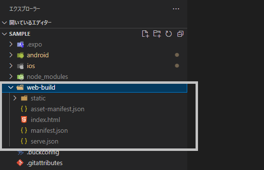

# React Nativeアプリをビルドする手順(Web)

## 5. ReactNativeプロジェクト作成
1. コマンドプロンプトを開く
2. 任意のフォルダに移動してサンプルのプロジェクトを作成する
```
npx create-react-native-app 【プロジェクト名】
```
3. 以下の文章が表示されタ場合、 `Enter` を押下する
```
npx: installed 1 in 1.307s
? How would you like to start » - Use arrow-keys. Return to submit.
>   Default new app
    Template from expo/examples: https://github.com/expo/examples
```
4. プロジェクト名のフォルダが作成されていれば成功
```
npx: installed 1 in 1.307s
√ How would you like to start » Default new app
√ Downloaded and extracted project files.

Using Yarn to install packages. You can pass --use-npm to use npm instead.

√ Installed JavaScript dependencies.
√ Skipped installing CocoaPods because operating system is not on macOS.

✅ Your project is ready!

To run your project, navigate to the directory and run one of the following yarn commands.

- cd Sample
- yarn android
- yarn ios # you need to use macOS to build the iOS project - use the Expo app if you need to do iOS development without a Mac
- yarn web
```

## 6. webサーバ起動
1. コマンドプロンプトを起動し、以下コマンドを実行する
```
npm install -g expo-cli
npm install react-dom react-native-web expo-dev-client babel-plugin-react-native-web webpack webpack-dev-server
npx uri-scheme add 【プロジェクト名】
npm run start
```
2. webサーバにアクセスする
    - デフォルトは http://localhost:19002/
    - webサーバ停止は `ctrl + c`

## 7. ビルド
1. コマンドプロンプトを起動し、以下のコマンドを実行する
```
expo build:web
```
2. プロジェクトフォルダ内に `web-build` フォルダが作成されていれば成功

