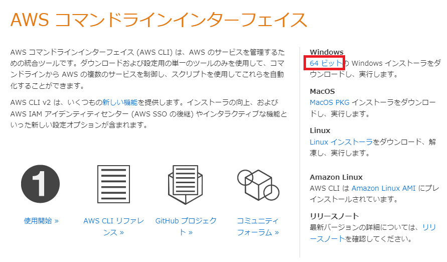
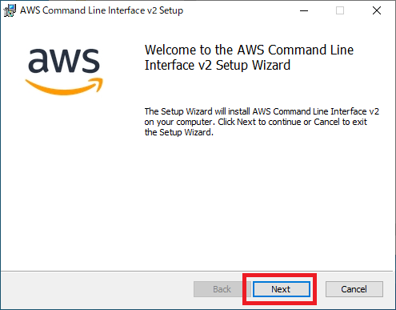
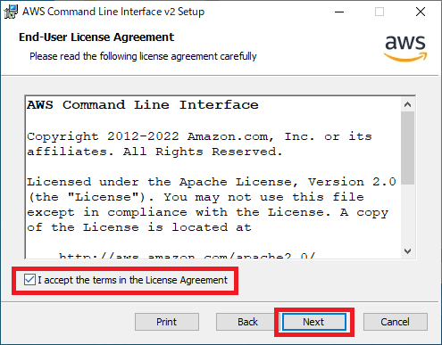
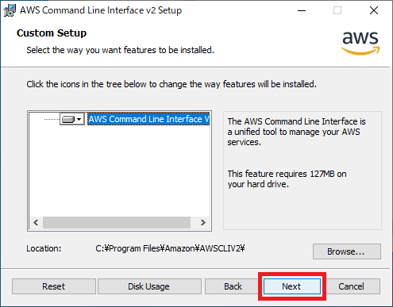
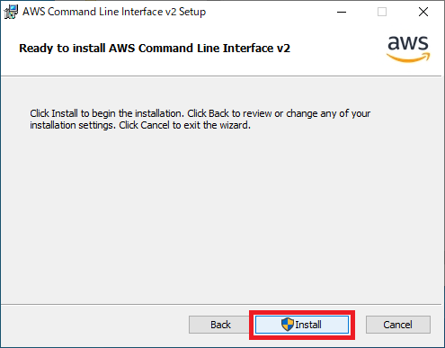
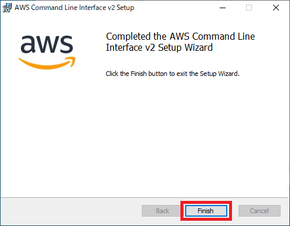
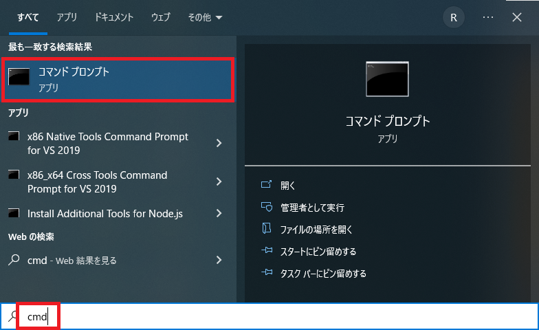
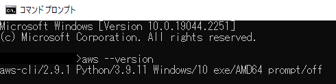

# 【Windows/Mac/Linux（Ubuntu）】AWS CLIインストール方法

## AWS CLIインストール方法【Windows】
1. インストーラをダウンロードする
   - [インストーラ](https://aws.amazon.com/jp/cli/)

2. `AWSCLIV2.msi` をダブルクリックして起動

3. `Next` を押下する

4. `I accept the terms in the License Agreement` にチェックを付け、 `Next` を押下する

5. `Next` を押下する

6. `Install` を押下する

7. `Finish` を押下する

8. `コマンドプロンプト` を開く

9. `aws --version` コマンドを実行する


## AWS CLIインストール方法【Mac】
`AWSCLIV2.pkg` をダウンロード
- コマンド
```
curl "https://awscli.amazonaws.com/AWSCLIV2.pkg" -o "AWSCLIV2.pkg"
```
- 実行例
```
% curl "https://awscli.amazonaws.com/AWSCLIV2.pkg" -o "AWSCLIV2.pkg"
  % Total    % Received % Xferd  Average Speed   Time    Time     Time  Current
                                 Dload  Upload   Total   Spent    Left  Speed
100 28.7M  100 28.7M    0     0  9988k      0  0:00:02  0:00:02 --:--:-- 9985k
```

`AWS CLI` をインストール
- コマンド
```
sudo installer -pkg ./AWSCLIV2.pkg -target /
```
- 実行例
```
% sudo installer -pkg ./AWSCLIV2.pkg -target /
Password:
installer: Package name is AWS Command Line Interface
installer: Installing at base path /
...省略
```

バージョン確認
- コマンド
```
which aws
aws --version
```
- 実行例
```
% which aws
/usr/local/bin/aws
% aws --version
aws-cli/2.9.2 Python/3.9.11 Darwin/19.6.0 exe/x86_64 prompt/off
```

お掃除
- コマンド
```
rm AWSCLIV2.pkg
```
- 実行例
```
% rm AWSCLIV2.pkg
```


## AWS CLIインストール方法【Linux（Ubuntu）】
`awscliv2.zip` をダウンロード
- コマンド
```
curl "https://awscli.amazonaws.com/awscli-exe-linux-x86_64.zip" -o "awscliv2.zip"
unzip awscliv2.zip
```
- 実行例
```
$ curl "https://awscli.amazonaws.com/awscli-exe-linux-x86_64.zip" -o "awscliv2.zip"
  % Total    % Received % Xferd  Average Speed   Time    Time     Time  Current
                                 Dload  Upload   Total   Spent    Left  Speed
100 45.8M  100 45.8M    0     0  57.2M      0 --:--:-- --:--:-- --:--:-- 57.2M
$ unzip awscliv2.zip
Archive:  awscliv2.zip
   creating: aws/
   creating: aws/dist/
...省略
```

`AWS CLI` をインストール
- コマンド
```
sudo ./aws/install
```
- 実行例
```
$ sudo ./aws/install
You can now run: /usr/local/bin/aws --version
```

バージョン確認
- コマンド
```
aws --version
```
- 実行例
```
$ aws --version
aws-cli/2.9.2 Python/3.9.11 Linux/5.15.0-53-generic exe/x86_64.ubuntu.20 prompt/off
```

お掃除
- コマンド
```
rm awscliv2.zip
rm -Rf aws
```
- 実行例
```
$ rm awscliv2.zip
$ rm -Rf aws
```

## 参考文献
- [AWS コマンドラインインターフェイス](https://aws.amazon.com/jp/cli/)
- [AWS CLI の最新バージョンをインストールまたは更新します。](https://docs.aws.amazon.com/ja_jp/cli/latest/userguide/getting-started-install.html)