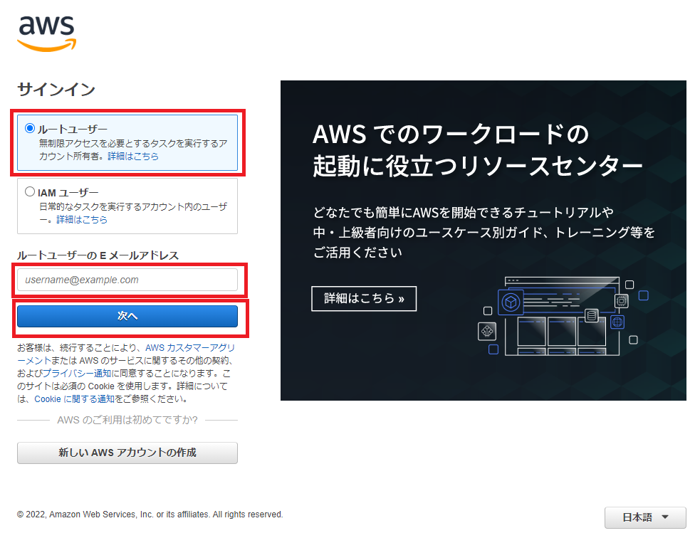
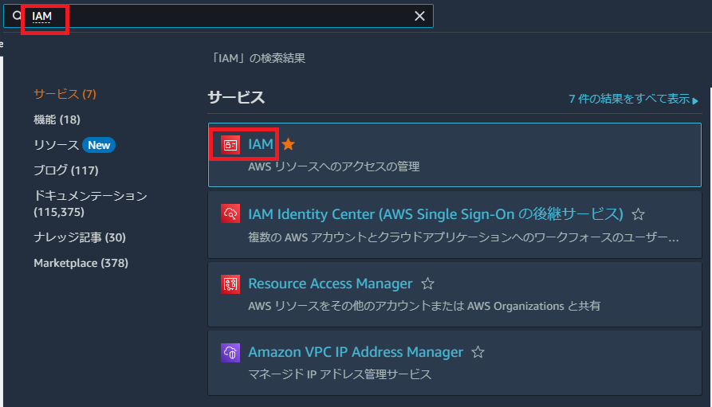
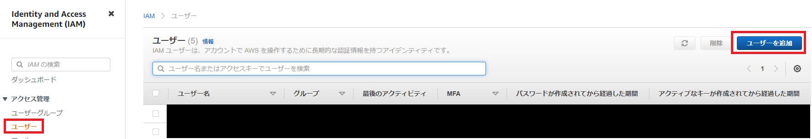
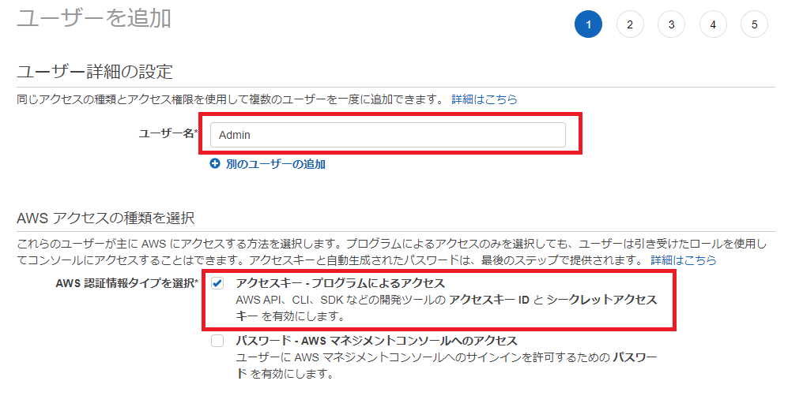
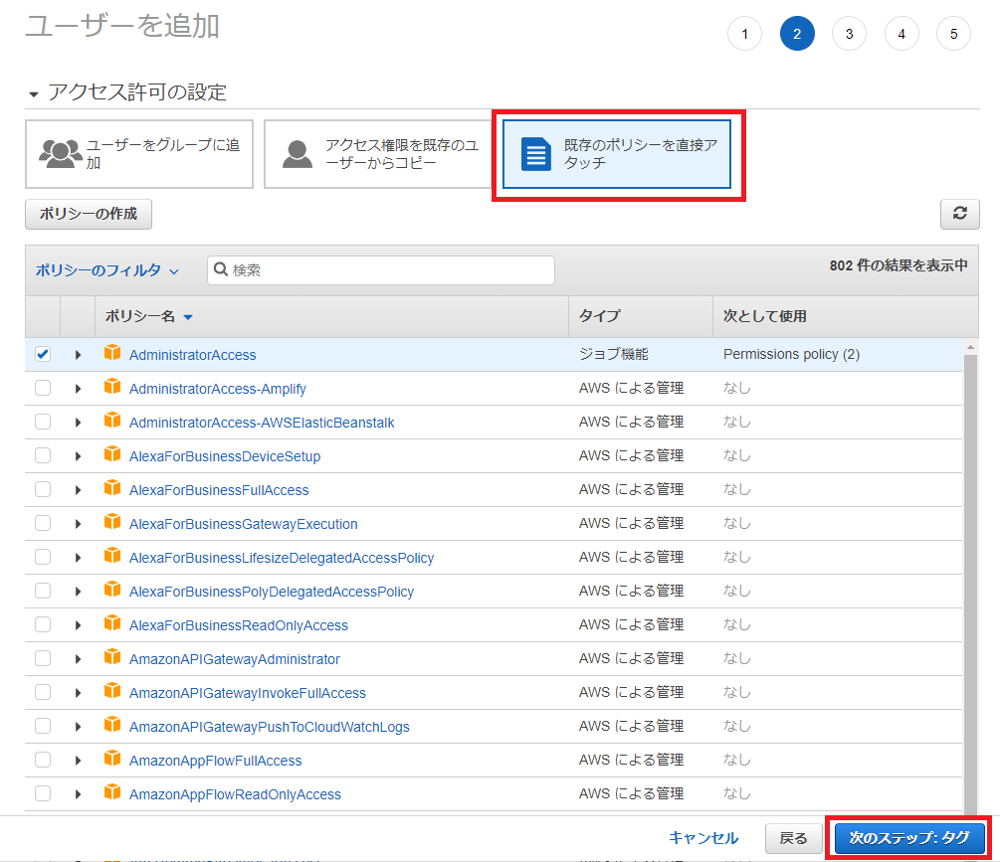
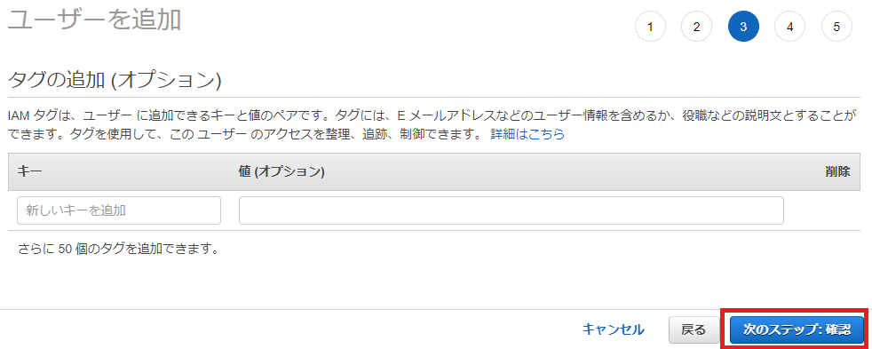
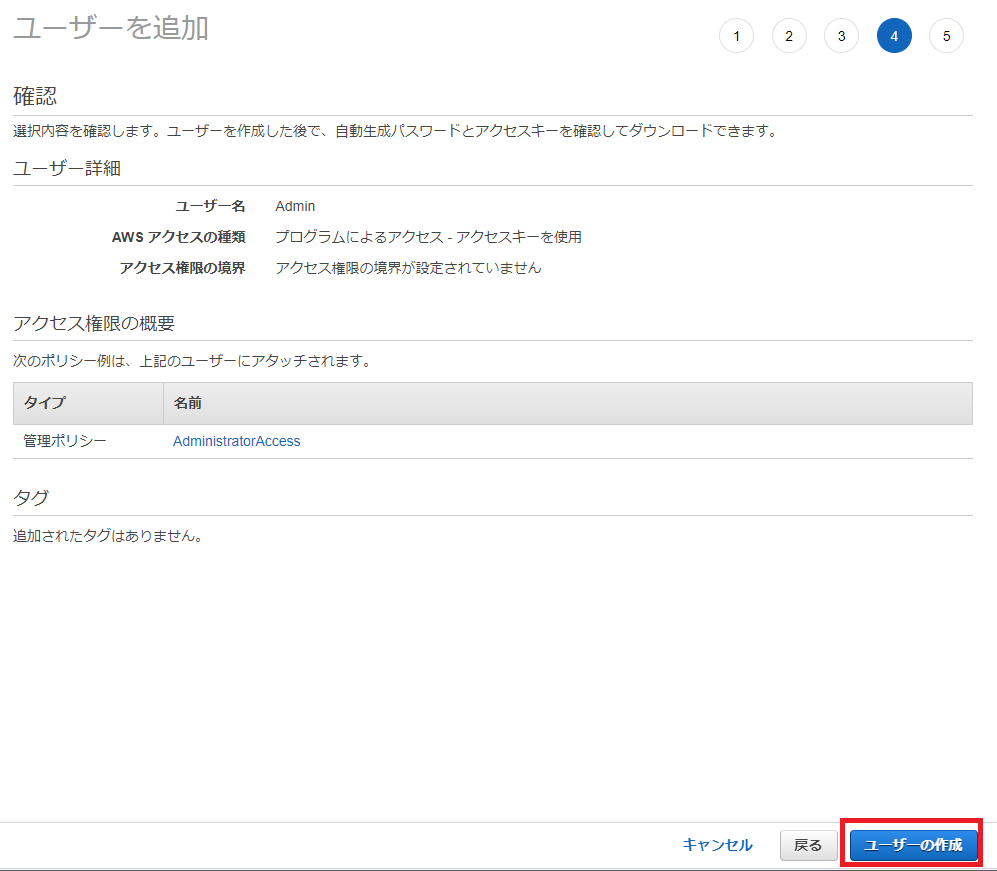
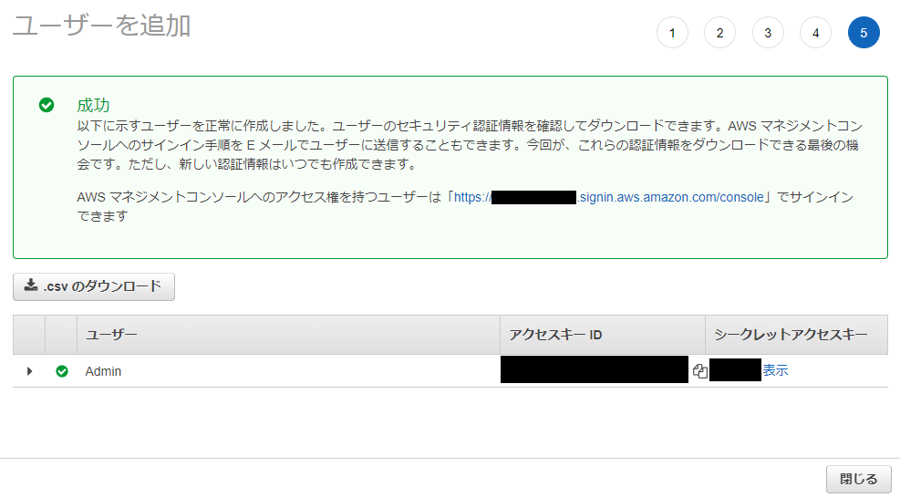

# AWS CLI操作用IAMユーザ作成
1. AWSにログインする
    - [AWS](https://console.aws.amazon.com/console/home)

2. `IAM` を検索する

3. `ユーザー > ユーザーを追加` を押下する

4. `ユーザー名` を入力し、 `アクセスキー-プログラムによるアクセス` にチェックを付け、`次のステップ` を押下する

5. `既存のポリシーを直接アタッチ` を選択し、 `AdministratorAccess` にチェックを付け、`次のステップ` を押下する

6. `次のステップ` を押下する

7. `ユーザー作成` を押下する

8. `アクセスキーID` と `シークレットアクセスキー` をメモする

9. `aws configure` コマンドを実行する
**実行例**
```
$ aws configure
AWS Access Key ID [None]:
AWS Secret Access Key [None]:
Default region name [None]:
Default output format [None]:
```
- `AWS Access Key ID ` ：8でメモした【アクセスキーID】
- `AWS Secret Access Key` ：8でメモした【シークレットアクセスキー】
- `Default region name` ：AWSのリージョン（例：`us-east-1`、`ap-northeast-1` 等）
- `Default output format` ：出力フォーマット（例：`text`、`json` 等）
