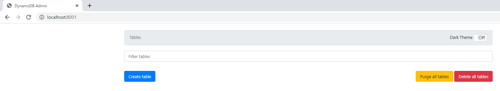
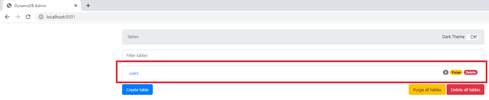

# Docker-Composeでdynamodb-localの環境構築

## はじめに
このリポジトリは、DockerHubの[amazon/dynamodb-local](https://hub.docker.com/r/amazon/dynamodb-local)を実際に使用した時の備忘録です。

dynamodb操作に使用したJavaScriptファイルはこのリポジトリに保管してます。

## フォルダ構成

```
.
├── docker-compose.yml
├── .aws
│   └── credentials
└── js
    ├── Dockerfile
    ├── createTable.js
    ├── putItem.js
    ├── scanAllItem.js
    ├── getItem.js
    ├── queryItem.js
    ├── scanItem.js
    ├── updateItem.js
    ├── deleteItem.js
    ├── deleteTable.js
    ├── node_modules
    │   └── ...省略
    ├── package-lock.json
    └── package.json
```

- `docker-compose.yml`：dynamodb-local、dynamodb-admin、node:18.7-alpineを起動するDocker-Composeファイル。
- `.aws/credentials`：dummyのAWSクレデンシャルファイル。
- `js/Dockerfile`：node:18.7-alpineのDockerfile。
- `js/createTable.js`：テーブル作成コード。
- `js/putItem.js`：Item挿入コード。
- `js/scanAllItem.js`：全Item取得コード。
- `js/getItem.js`：単一Item取得コード。
- `js/queryItem.js`：条件に一致するItem取得コード。
- `js/scanItem.js`：条件に一致するItem取得コード。
- `js/updateItem.js`：Item更新コード。
- `js/deleteItem.js`：Item削除コード。
- `js/deleteTable.js`：テーブル削除コード。
- `js/node_modules`：Node.jsのライブラリ・パッケージ。
- `js/package.json, js/package-lock.json`：Node.jsパッケージファイル。

## 事前準備
1. Docker-composeを実行できる環境
    - [UbuntuにDockerをインストールする手順](https://qiita.com/ryome/items/4b6b934b1b2021acfa26)
    - [UbuntuにDocker-composeをインストールする手順](https://qiita.com/ryome/items/56a3263f347a08bd860f)

## 手順

1. Docker-Composeでdynamodb-localを起動する
2. dynamodb-localの動作検証

以下、実際の手順実行例

### 1. Docker-Composeでdynamodb-localを起動する
1. GitHubから資材取得する
- コマンド
```
git clone https://github.com/ryomeblog/dynamodb-local-sample.git
```
- 実行例
```
$ git clone https://github.com/ryomeblog/dynamodb-local-sample.git
Cloning into 'dynamodb-local-sample'...
remote: Enumerating objects: 19, done.
remote: Counting objects: 100% (19/19), done.
remote: Compressing objects: 100% (14/14), done.
remote: Total 19 (delta 5), reused 19 (delta 5), pack-reused 0
Unpacking objects: 100% (19/19), 29.26 KiB | 1.46 MiB/s, done.
```

2. Docker-Composeでdynamodb-localを起動する
- コマンド
```
docker-compose up -d --build
docker-compose ps
```
- 実行例
```
$ docker-compose up -d --build
Creating network "dynamo-sample_default" with the default driver
Building node-test
Sending build context to Docker daemon  17.41kB
Step 1/3 : FROM node:18.7-alpine
 ---> eecd5234277e
...省略
Creating dynamodb-local ... done
Creating node-test      ... done
Creating dynamodb-admin ... done
$ docker-compose ps
     Name                   Command               State                    Ports
--------------------------------------------------------------------------------------------------
dynamodb-admin   docker-entrypoint.sh node  ...   Up      0.0.0.0:8001->8001/tcp,:::8001->8001/tcp
dynamodb-local   java -jar DynamoDBLocal.ja ...   Up      0.0.0.0:8000->8000/tcp,:::8000->8000/tcp
node-test        docker-entrypoint.sh node        Up
```

## 2. dynamodb-localの動作検証
1. node.jsコンソールに入る
- コマンド
```
docker-compose exec node-test sh
```
- 実行例
```
$ docker-compose exec node-test sh
/app # npm install
...省略
up to date, audited 31 packages in 513ms

12 packages are looking for funding
  run `npm fund` for details

found 0 vulnerabilities
/app # ls
Dockerfile         deleteTable.js     package-lock.json  queryItem.js       updateItem.js
createTable.js     getItem.js         package.json       scanAllItem.js
deleteItem.js      node_modules       putItem.js         scanItem.js
```

2. dynamodb-adminの確認
http://localhost:8001/ にアクセスする。



3. テーブル作成
jsファイル：createTable.js
```
const AWS = require('aws-sdk');

const myCredentials = new AWS.SharedIniFileCredentials({ profile: 'dummy' });
AWS.config = new AWS.Config({
    credentials: myCredentials,
    region: 'ap-northeast-1',
    endpoint: 'dynamodb-local:8000',
    sslEnabled: false
});
const dynamoDB = new AWS.DynamoDB();

const params = {
    TableName: 'users',
    AttributeDefinitions: [
        { AttributeName: 'user_id', AttributeType: 'N' },
        { AttributeName: 'created_at', AttributeType: 'S' },
        { AttributeName: 'post_id', AttributeType: 'N' }
    ],
    KeySchema: [
        { AttributeName: 'user_id', KeyType: 'HASH' },
        { AttributeName: 'created_at', KeyType: 'RANGE' }
    ],
    LocalSecondaryIndexes: [
        {
            IndexName: 'post_local_index',
            Projection: {
                ProjectionType: 'ALL'
            },
            KeySchema: [
                { AttributeName: 'user_id', KeyType: 'HASH' },
                { AttributeName: 'post_id', KeyType: 'RANGE' }
            ]
        }
    ],
    GlobalSecondaryIndexes: [
        {
            IndexName: 'post_global_index',
            Projection: {
                ProjectionType: 'ALL'
            },
            KeySchema: [
                { AttributeName: 'post_id', KeyType: 'HASH' }
            ],
            ProvisionedThroughput: {
                ReadCapacityUnits: 10,
                WriteCapacityUnits: 10
            }
        }
    ],
    ProvisionedThroughput: {
        ReadCapacityUnits: 10,
        WriteCapacityUnits: 10
    }
}

dynamoDB.createTable(params, (err, data) => {
    if (err) {
        console.error('Unable to create table. Error JSON:', JSON.stringify(err, null, 2))
    } else {
        console.log('Created table. Table description JSON:', JSON.stringify(data, null, 2))
    }
});
```

- コマンド
```
node createTable.js
```
- 実行例
```
/app # node createTable.js
Created table. Table description JSON: {
...省略
```
http://localhost:8001/ にアクセスし、`users` テーブルが作成されたことを確認する。



4. Item挿入（put）
jsファイル：putItem.js
```
const AWS = require('aws-sdk');

const myCredentials = new AWS.SharedIniFileCredentials({ profile: 'dummy' });
AWS.config = new AWS.Config({
    credentials: myCredentials,
    region: 'ap-northeast-1',
    endpoint: 'dynamodb-local:8000',
    sslEnabled: false
});

const documentClient = new AWS.DynamoDB.DocumentClient();

items = [
    { user_id: 1, post_id: 2, created_at: '1544741492', message: 'aaaaaaaaaaaaaa' },
    { user_id: 2, post_id: 9, created_at: '1544745092', message: 'bbbbbbbbbbbbbb' },
    { user_id: 3, post_id: 3, created_at: '1544748692', message: 'cccccccccccccc' },
    { user_id: 1, post_id: 5, created_at: '1544752292', message: 'dddddddddddddd' },
    { user_id: 5, post_id: 3, created_at: '1544755892', message: 'eeeeeeeeeeeeee' },
]

items.forEach(item => {
    const params = {
        TableName: 'users',
        Item: {
            'user_id': item.user_id,
            'post_id': item.post_id,
            'created_at': item.created_at,
            'message': item.message
        }
    }
    documentClient.put(params, (err, data) => {
        if (err) console.log(err)
        else console.log(data)
    })
})
```

- コマンド
```
node putItem.js
```
- 実行例
```
/app # node putItem.js
{}
{}
{}
{}
{}
```

5. 全Item取得（scan）
jsファイル：scanAllItem.js
```
const AWS = require('aws-sdk');

const myCredentials = new AWS.SharedIniFileCredentials({ profile: 'dummy' });
AWS.config = new AWS.Config({
    credentials: myCredentials,
    region: 'ap-northeast-1',
    endpoint: 'dynamodb-local:8000',
    sslEnabled: false
});

const documentClient = new AWS.DynamoDB.DocumentClient();

const scanAll = async () => {
  let params = {
    TableName: 'users',
  }
  let items = []

  const scan = async () => {
    console.log('execute scan')
    console.log(params)
    const result = await documentClient.scan(params).promise()
    items.push(...result.Items)

    if (result.LastEvaluatedKey) {
      params.ExclusiveStartKey = result.LastEvaluatedKey
      await scan()
    }
  }

  try {
    await scan()
    return items
  } catch (err) {
    console.error(`[Error]: ${JSON.stringify(err)}`)
    return err
  }
}

(async () => {
  const items = await scanAll();
  console.log(JSON.stringify(items, null, 2));
})()
```

- コマンド
```
node scanAllItem.js
```
- 実行例
```
/app # node scanAllItem.js
execute scan
{ TableName: 'users' }
[
  {
    "created_at": "1544745092",
    "post_id": 9,
    "message": "bbbbbbbbbbbbbb",
    "user_id": 2
  },
  {
    "created_at": "1544741492",
    "post_id": 2,
    "message": "aaaaaaaaaaaaaa",
    "user_id": 1
  },
  {
    "created_at": "1544752292",
    "post_id": 5,
    "message": "dddddddddddddd",
    "user_id": 1
  },
  {
    "created_at": "1544748692",
    "post_id": 3,
    "message": "cccccccccccccc",
    "user_id": 3
  },
  {
    "created_at": "1544755892",
    "post_id": 3,
    "message": "eeeeeeeeeeeeee",
    "user_id": 5
  }
]
```

6. 単一Item取得（get）
jsファイル：getItem.js
```
const AWS = require('aws-sdk');

const myCredentials = new AWS.SharedIniFileCredentials({ profile: 'dummy' });
AWS.config = new AWS.Config({
    credentials: myCredentials,
    region: 'ap-northeast-1',
    endpoint: 'dynamodb-local:8000',
    sslEnabled: false
});

const documentClient = new AWS.DynamoDB.DocumentClient();

const params = {
    TableName: 'users',
    Key: {
        'user_id': 1,
        'created_at': '1544752292'
    }
};

documentClient.get(params, (err, data) => {
    if (err) console.log(JSON.stringify(err, null, 2))
    else console.log(JSON.stringify(data, null, 2))
});
```

- コマンド
```
node getItem.js
```
- 実行例
```
/app # node getItem.js
{
  "Item": {
    "created_at": "1544752292",
    "post_id": 5,
    "message": "dddddddddddddd",
    "user_id": 1
  }
}
```

7. 条件に一致するItem取得（query）
jsファイル：queryItem.js
```
const AWS = require('aws-sdk');

const myCredentials = new AWS.SharedIniFileCredentials({ profile: 'dummy' });
AWS.config = new AWS.Config({
    credentials: myCredentials,
    region: 'ap-northeast-1',
    endpoint: 'dynamodb-local:8000',
    sslEnabled: false
});

const documentClient = new AWS.DynamoDB.DocumentClient();

const params = {
    TableName: 'users',
    KeyConditionExpression: 'user_id = :user_id and created_at >= :created_at',
    ExpressionAttributeValues: {
        ':user_id': 1,
        ':created_at': '1544752292'
    }
};
documentClient.query(params, (err, data) => {
    if (err) console.log(JSON.stringify(err, null, 2))
    else console.log(JSON.stringify(data, null, 2))
});
```

- コマンド
```
node queryItem.js
```
- 実行例
```
/app # node queryItem.js
{
  "Items": [
    {
      "created_at": "1544752292",
      "post_id": 5,
      "message": "dddddddddddddd",
      "user_id": 1
    }
  ],
  "Count": 1,
  "ScannedCount": 1
}
```

8. 条件に一致するItem取得（scan）
jsファイル：scanItem.js
```
const AWS = require('aws-sdk');

const myCredentials = new AWS.SharedIniFileCredentials({ profile: 'dummy' });
AWS.config = new AWS.Config({
    credentials: myCredentials,
    region: 'ap-northeast-1',
    endpoint: 'dynamodb-local:8000',
    sslEnabled: false
});

const documentClient = new AWS.DynamoDB.DocumentClient();

const params = {
    TableName: 'users',
    FilterExpression: 'message = :message',
    ExpressionAttributeValues: { ':message': 'cccccccccccccc' }
};
documentClient.scan(params, (err, data) => {
    if (err) console.log(JSON.stringify(err, null, 2))
    else console.log(JSON.stringify(data, null, 2))
});

```

- コマンド
```
node scanItem.js
```
- 実行例
```
/app # node queryItem.js
{
  "Items": [
    {
      "created_at": "1544752292",
      "post_id": 5,
      "message": "dddddddddddddd",
      "user_id": 1
    }
  ],
  "Count": 1,
  "ScannedCount": 1
}
/app # node scanItem.js
{
  "Items": [
    {
      "created_at": "1544748692",
      "post_id": 3,
      "message": "cccccccccccccc",
      "user_id": 3
    }
  ],
  "Count": 1,
  "ScannedCount": 5
}
```

9. Item更新（update）
jsファイル：updateItem.js
```
const AWS = require('aws-sdk');

const myCredentials = new AWS.SharedIniFileCredentials({ profile: 'dummy' });
AWS.config = new AWS.Config({
    credentials: myCredentials,
    region: 'ap-northeast-1',
    endpoint: 'dynamodb-local:8000',
    sslEnabled: false
});

const documentClient = new AWS.DynamoDB.DocumentClient();

const params = {
    TableName: 'users',
    Key: {
        user_id: 3,
        created_at: '1544748692'
    },
    UpdateExpression: 'set message = :message, post_id=:post_id',
    ExpressionAttributeValues: {
        ':message': 'update_xxxxxxxxxxxxxxx',
        ':post_id': 100
    },
    ReturnValues: 'ALL_NEW'
}
documentClient.update(params, (err, data) => {
    if (err) console.log(JSON.stringify(err, null, 2))
    else console.log(JSON.stringify(data, null, 2))
});
```

- コマンド
```
node updateItem.js
```
- 実行例
```
/app # node queryItem.js
{
  "Items": [
    {
      "created_at": "1544752292",
      "post_id": 5,
      "message": "dddddddddddddd",
      "user_id": 1
    }
  ],
  "Count": 1,
  "ScannedCount": 1
}
/app # node scanItem.js
{
  "Items": [
    {
      "created_at": "1544748692",
      "post_id": 3,
      "message": "cccccccccccccc",
      "user_id": 3
    }
  ],
  "Count": 1,
  "ScannedCount": 5
}
/app # node updateItem.js
{
  "Attributes": {
    "created_at": "1544748692",
    "post_id": 100,
    "message": "update_xxxxxxxxxxxxxxx",
    "user_id": 3
  }
}
```

10. Item削除（delete）
jsファイル：deleteItem.js
```
const AWS = require('aws-sdk');

const myCredentials = new AWS.SharedIniFileCredentials({ profile: 'dummy' });
AWS.config = new AWS.Config({
    credentials: myCredentials,
    region: 'ap-northeast-1',
    endpoint: 'dynamodb-local:8000',
    sslEnabled: false
});

const documentClient = new AWS.DynamoDB.DocumentClient();

const params = {
    TableName: 'users',
    Key: {
        user_id: 1,
        created_at: '1544752292'
    }
}
documentClient.delete(params, (err, data) => {
    if (err) console.log(JSON.stringify(err, null, 2))
    else console.log(JSON.stringify(data, null, 2))
});
```

- コマンド
```
node deleteItem.js
```
- 実行例
```
/app # node deleteItem.js
{}
```

11. テーブル削除
jsファイル：deleteTable.js
```
const AWS = require('aws-sdk');

const myCredentials = new AWS.SharedIniFileCredentials({ profile: 'dummy' });
AWS.config = new AWS.Config({
    credentials: myCredentials,
    region: 'ap-northeast-1',
    endpoint: 'dynamodb-local:8000',
    sslEnabled: false
});

const dynamoDB = new AWS.DynamoDB();
const params = { TableName: 'users' };
dynamoDB.deleteTable(params, (err, data) => {
    if (err) {
        console.error('Unable to delete table. Error JSON:', JSON.stringify(err, null, 2))
    } else {
        console.log('Deleted table. Table description JSON:', JSON.stringify(data, null, 2))
    }
});
```

- コマンド
```
node deleteTable.js
```
- 実行例
```
/app # node deleteTable.js
Deleted table. Table description JSON: {
...省略
```

http://localhost:8001/ にアクセスし、`users` テーブルが削除されたことを確認する。


# 参考文献
- https://hackers-high.com/aws/dynamodb-local-development/
- https://www.wakuwakubank.com/posts/670-nodejs-dynamodb/
