# CDK環境構築

## AWS CLIインストール方法

### AWS CLIインストール方法【Windows】
1. インストーラをダウンロードする
   - [インストーラ](https://aws.amazon.com/jp/cli/)
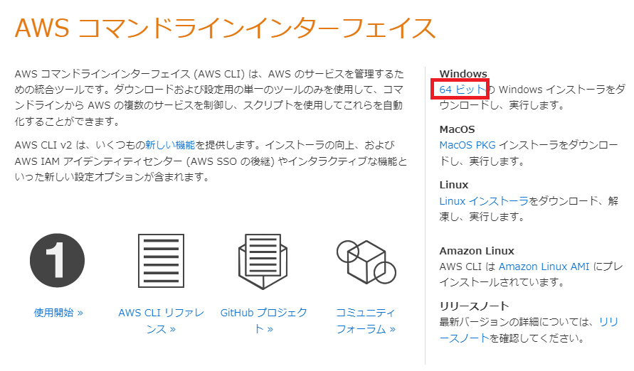
2. `AWSCLIV2.msi` をダブルクリックして起動
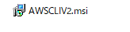
3. `Next` を押下する
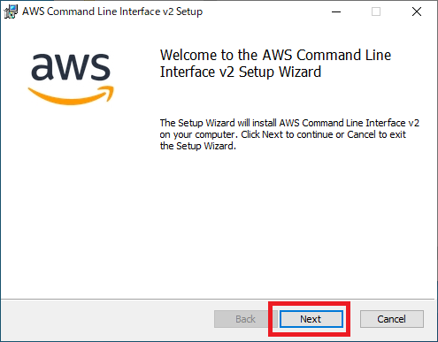
4. `I accept the terms in the License Agreement` にチェックを付け、 `Next` を押下する
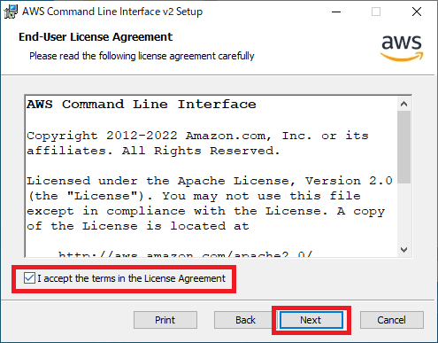
5. `Next` を押下する
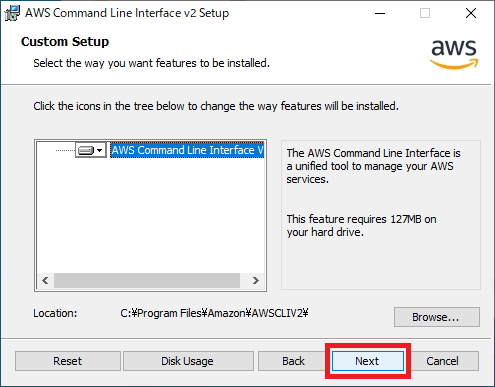
6. `Install` を押下する
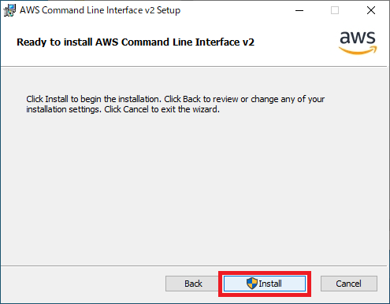
7. `Finish` を押下する
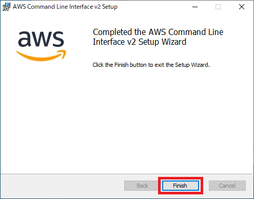
8. `コマンドプロンプト` を開く
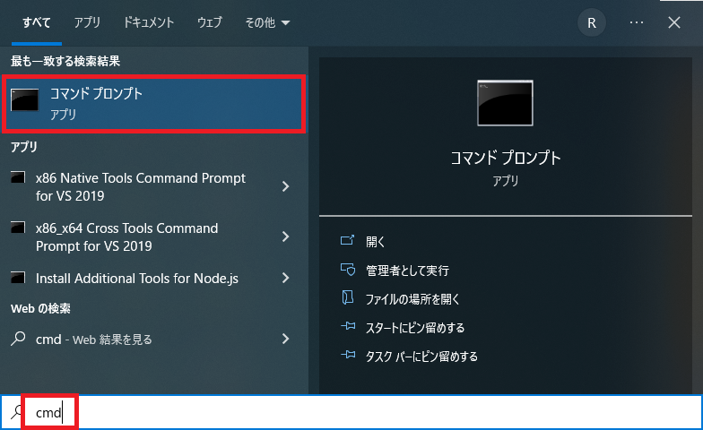
9. `aws --version` コマンドを実行する
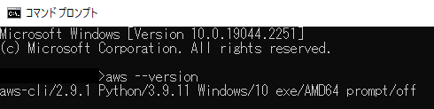

### AWS CLIインストール方法【Mac】
**`AWSCLIV2.pkg` をダウンロード**
- コマンド
```
curl "https://awscli.amazonaws.com/AWSCLIV2.pkg" -o "AWSCLIV2.pkg"
```
- 実行例
```
% curl "https://awscli.amazonaws.com/AWSCLIV2.pkg" -o "AWSCLIV2.pkg"
  % Total    % Received % Xferd  Average Speed   Time    Time     Time  Current
                                 Dload  Upload   Total   Spent    Left  Speed
100 28.7M  100 28.7M    0     0  9988k      0  0:00:02  0:00:02 --:--:-- 9985k
```

**`AWS CLI` をインストール**
- コマンド
```
sudo installer -pkg ./AWSCLIV2.pkg -target /
```
- 実行例
```
% sudo installer -pkg ./AWSCLIV2.pkg -target /
Password:
installer: Package name is AWS Command Line Interface
installer: Installing at base path /
...省略
```

**バージョン確認**
- コマンド
```
which aws
aws --version
```
- 実行例
```
% which aws
/usr/local/bin/aws
% aws --version
aws-cli/2.9.2 Python/3.9.11 Darwin/19.6.0 exe/x86_64 prompt/off
```

**お掃除**
- コマンド
```
rm AWSCLIV2.pkg
```
- 実行例
```
% rm AWSCLIV2.pkg
```


### AWS CLIインストール方法【Linux（Ubuntu）】
**`awscliv2.zip` をダウンロード**
- コマンド
```
curl "https://awscli.amazonaws.com/awscli-exe-linux-x86_64.zip" -o "awscliv2.zip"
unzip awscliv2.zip
```
- 実行例
```
$ curl "https://awscli.amazonaws.com/awscli-exe-linux-x86_64.zip" -o "awscliv2.zip"
  % Total    % Received % Xferd  Average Speed   Time    Time     Time  Current
                                 Dload  Upload   Total   Spent    Left  Speed
100 45.8M  100 45.8M    0     0  57.2M      0 --:--:-- --:--:-- --:--:-- 57.2M
$ unzip awscliv2.zip
Archive:  awscliv2.zip
   creating: aws/
   creating: aws/dist/
...省略
```

**`AWS CLI` をインストール**
- コマンド
```
sudo ./aws/install
```
- 実行例
```
$ sudo ./aws/install
You can now run: /usr/local/bin/aws --version
```

**バージョン確認**
- コマンド
```
aws --version
```
- 実行例
```
$ aws --version
aws-cli/2.9.2 Python/3.9.11 Linux/5.15.0-53-generic exe/x86_64.ubuntu.20 prompt/off
```

**お掃除**
- コマンド
```
rm awscliv2.zip
rm -Rf aws
```
- 実行例
```
$ rm awscliv2.zip
$ rm -Rf aws
```

## AWS CLI操作用IAMユーザ作成

1. AWSにログインする
    - [AWS](https://console.aws.amazon.com/console/home?sc_icampaign=adp_jp_header_v3_default_202205&sc_ichannel=ha&sc_icontent=awssm_10926&sc_iplace=cta&trk=ha_adp_jp_header_v3_default_202205)
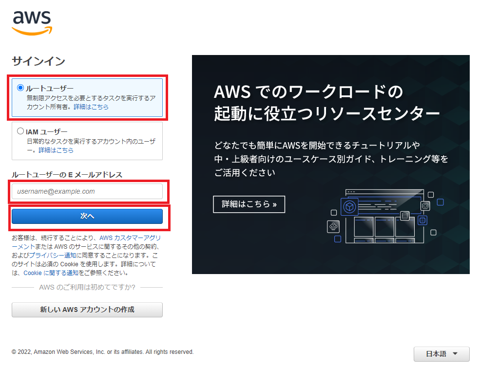
2. `IAM` を検索する
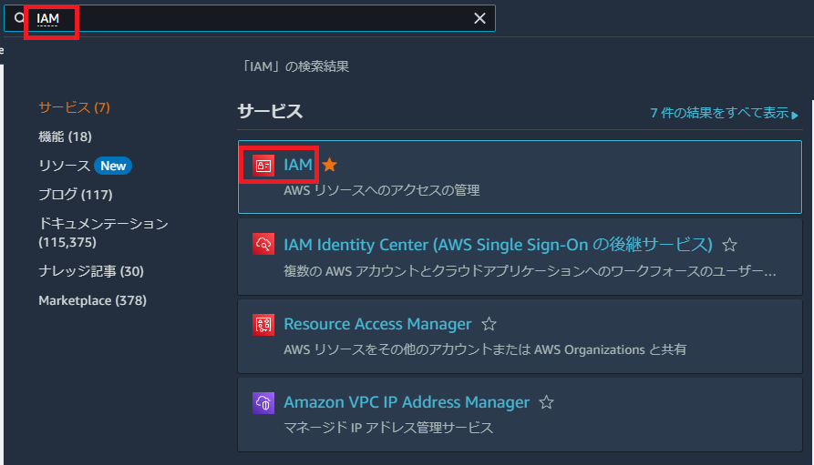
3. `ユーザー > ユーザーを追加` を押下する
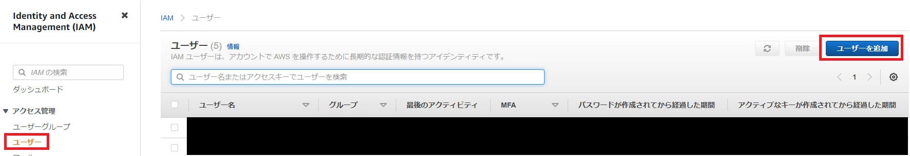
4. `ユーザー名` を入力し、 `アクセスキー-プログラムによるアクセス` にチェックを付け、`次のステップ` を押下する
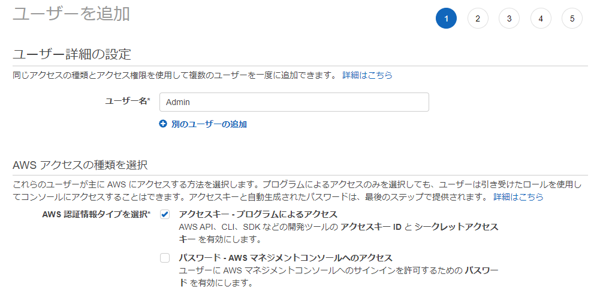
5. `既存のポリシーを直接アタッチ` を選択し、 `AdministratorAccess` にチェックを付け、`次のステップ` を押下する
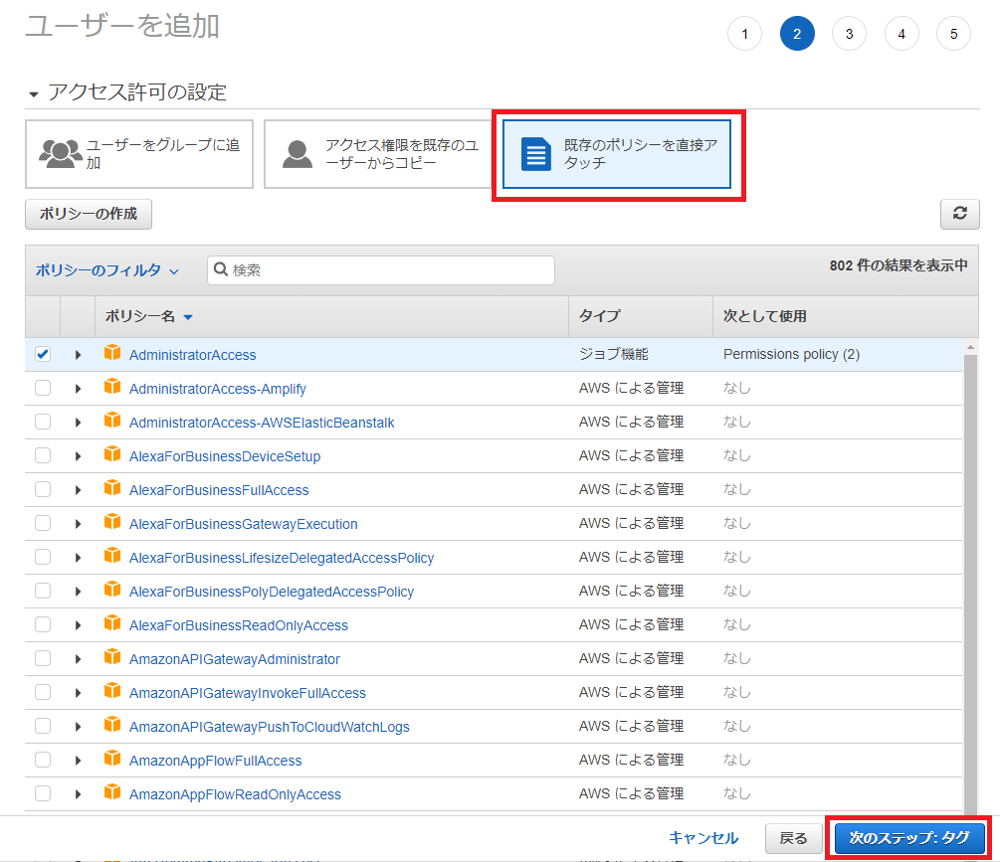
6. `次のステップ` を押下する
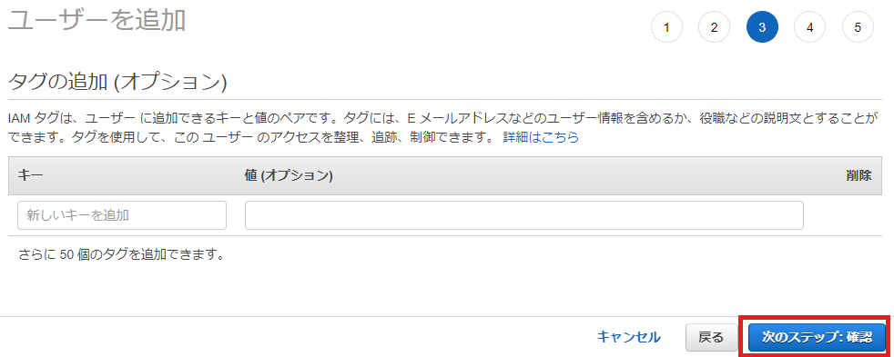
7. `ユーザー作成` を押下する
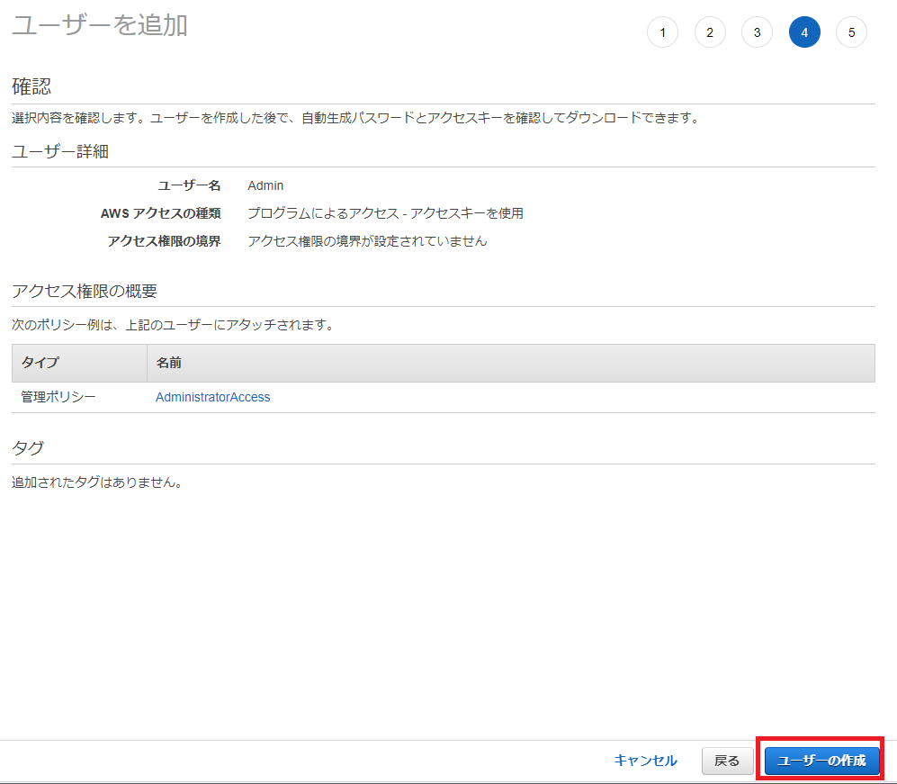
8. `アクセスキーID` と `シークレットアクセスキー` をメモする
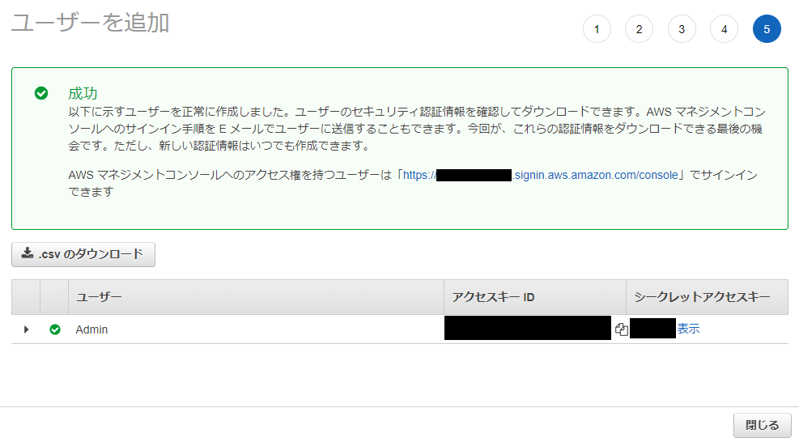
9. `aws configure` コマンドを実行する
**実行例**
```
$ aws configure
AWS Access Key ID [None]:
AWS Secret Access Key [None]:
Default region name [None]:
Default output format [None]:
```
- `AWS Access Key ID ` ：8でメモした【アクセスキーID】
- `AWS Secret Access Key` ：8でメモした【シークレットアクセスキー】
- `Default region name` ：AWSのリージョン（例：`us-east-1`、`ap-northeast-1` 等）
- `Default output format` ：出力フォーマット（例：`text`、`json` 等）


## Node.jsインストール方法

### Node.jsインストール方法【Windows】
1. 以下のURLにアクセスする。
    - [インストーラー](https://nodejs.org/ja/)
2. 推奨版をクリック

3. フォルダを開く

4. `node-v16.14.0-x64`をダブルクリック

5. `Next`をクリック

6. チェックボックスにチェックをして`Next`をクリック

7. `Next`をクリック

8. `Next`をクリック

9.  `Next`をクリック

10. `Install`をクリック

11. ダウンロード中

12. `finish`をクリック

13.  コマンドプロンプトを開き、 `node --version`と`npm --version` コマンドを実行する


### Node.jsインストール方法【Mac】
**Homebrewインストール**
- コマンド
```
/bin/bash -c "$(curl -fsSL https://raw.githubusercontent.com/Homebrew/install/HEAD/install.sh)"
brew -v
```
- 実行例
```
% /bin/bash -c "$(curl -fsSL https://raw.githubusercontent.com/Homebrew/install/HEAD/install.sh)"
==> Checking for `sudo` access (which may request your password)...
Password:
==> You are using macOS 10.15.
==> We (and Apple) do not provide support for this old version.
This installation may not succeed.
After installation, you will encounter build failures with some formulae.
Please create pull requests instead of asking for help on Homebrew's GitHub,
Twitter or any other official channels. You are responsible for resolving any
issues you experience while you are running this old version.

==> This script will install:
/usr/local/bin/brew
/usr/local/share/doc/homebrew
/usr/local/share/man/man1/brew.1
/usr/local/share/zsh/site-functions/_brew
/usr/local/etc/bash_completion.d/brew
/usr/local/Homebrew

Press RETURN/ENTER to continue or any other key to abort:
==> /usr/bin/sudo /usr/sbin/chown -R 【ユーザ名】:admin /usr/local/Homebrew
==> Downloading and installing Homebrew...
remote: Enumerating objects: 12497, done.
remote: Counting objects: 100% (3870/3870), done.
remote: Compressing objects: 100% (31/31), done.
...省略
% brew -v
Homebrew 3.6.13
Homebrew/homebrew-core (git revision 22e4c30a566; last commit 2022-11-29)
Homebrew/homebrew-cask (git revision 62ecebffe4; last commit 2022-11-29)
```

**Nodebrewインストールする**
- コマンド
```
brew install nodebrew
nodebrew -v
```
- 実行例
```
% brew install nodebrew
==> Downloading https://ghcr.io/v2/homebrew/core/nodebrew/manifests/1.2.0
######################################################################## 100.0%
==> Downloading https://ghcr.io/v2/homebrew/core/nodebrew/blobs/sha256:eed2aeff4fd05a4c2969d670ce9a38b
==> Downloading from https://pkg-containers.githubusercontent.com/ghcr1/blobs/sha256:eed2aeff4fd05a4c2
######################################################################## 100.0%
==> Pouring nodebrew--1.2.0.all.bottle.tar.gz
==> Caveats
% nodebrew -v
nodebrew 1.2.0

Usage:
    nodebrew help                         Show this message
    nodebrew install <version>            Download and install <version> (from binary)
    nodebrew compile <version>            Download and install <version> (from source)
    nodebrew install-binary <version>     Alias of `install` (For backward compatibility)
    nodebrew uninstall <version>          Uninstall <version>
    nodebrew use <version>                Use <version>
    nodebrew list                         List installed versions
    nodebrew ls                           Alias for `list`
    nodebrew ls-remote                    List remote versions
    nodebrew ls-all                       List remote and installed versions
    nodebrew alias <key> <value>          Set alias
    nodebrew unalias <key>                Remove alias
    nodebrew clean <version> | all        Remove source file
    nodebrew selfupdate                   Update nodebrew
    nodebrew migrate-package <version>    Install global NPM packages contained in <version> to current version
    nodebrew exec <version> -- <command>  Execute <command> using specified <version>
    nodebrew prune [--dry-run]            Uninstall old versions, keeping the latest version for each major version

Example:
    # install
    nodebrew install v8.9.4

    # use a specific version number
    nodebrew use v8.9.4
```

**Node.jsインストール**
- コマンド
```
nodebrew setup
nodebrew install-binary stable
nodebrew ls
nodebrew use 【バージョン】
nodebrew ls
```
- 実行例
```
% nodebrew setup
Fetching nodebrew...
Installed nodebrew in $HOME/.nodebrew
...省略
% nodebrew install-binary stable
Fetching: https://nodejs.org/dist/v18.12.1/node-v18.12.1-darwin-x64.tar.gz
############################################################################################### 100.0%
Installed successfully
% nodebrew ls
v18.12.1

current: none
% nodebrew use v18.12.1
use v18.12.1
% nodebrew ls
v18.12.1

current: v18.12.1
```

**環境パス設定**
- コマンド
```
echo 'export PATH=$HOME/.nodebrew/current/bin:$PATH' >> ~/.bash_profile
source ~/.bash_profile
```
- 実行例
```
% echo 'export PATH=$HOME/.nodebrew/current/bin:$PATH' >> ~/.bash_profile
% source ~/.bash_profile
```

**バージョン確認**
- コマンド
```
node -v
npm -v
```
- 実行例
```
% node -v
v18.12.1
% npm -v
8.19.2
```

### Node.jsインストール方法【Linux（Ubuntu）】
**Node.jsインストール**
- コマンド
```
sudo apt update
sudo apt install nodejs
```
- 実行例
```
$ sudo apt update
Get:1 http://security.ubuntu.com/ubuntu focal-security InRelease [114 kB]
Hit:2 https://download.docker.com/linux/ubuntu focal InRelease
Hit:3 https://deb.nodesource.com/node_12.x focal InRelease
Hit:4 http://archive.ubuntu.com/ubuntu focal InRelease  
...省略
$ sudo apt install nodejs
Reading package lists... Done
Building dependency tree       
Reading state information... Done
...省略
```

**npmパッケージインストール**
- コマンド
```
sudo apt install npm
```
- 実行例
```
$ sudo apt install nodejs
パッケージリストを読み込んでいます... 完了
依存関係ツリーを作成しています
状態情報を読み取っています... 完了
...省略
この操作後に追加で 24.6 MB のディスク容量が消費されます。
続行しますか? [Y/n] y
...省略
```

**バージョン確認**
- コマンド
```
node -v
npm -v
```
- 実行例
```
$ node -v
v10.19.0
$ npm -v
6.14.4
```

## AWS CDK Toolkitインストール方法

**Node.jsを最新の安定バージョンにする（Linux（Ubuntu）の場合）**
- コマンド
```
sudo npm install -g n
n --stable
sudo n stable
sudo n
node -v
sudo npm update -g
npm -v
```
- 実行例
```
$ sudo npm install -g n
...省略
added 1 package in 196ms
$ n --stable
18.12.1
$ sudo n stable
     copying : node/18.12.1
   installed : v18.12.1 (with npm 8.19.2)
$ node -v
v18.12.1
$ sudo npm update -g
removed 14 packages, changed 75 packages, and audited 225 packages in 2s

14 packages are looking for funding
  run `npm fund` for details

found 0 vulnerabilities
$ npm -v
9.1.2
```

**AWS CDK Toolkitインストール**
- コマンド
```
sudo npm install -g aws-cdk
cdk --version
```
- 実行例
```
$ sudo npm install -g aws-cdk

added 1 package in 789ms
$ cdk --version
2.53.0 (build 7690f43)
```

## 初期プロジェクト作成

**フォルダ作成**
- コマンド
```
mkdir cdk-workshop && cd cdk-workshop
```

**TypeScript CDK プロジェクトを作成**
- コマンド
```
cdk init sample-app --language typescript
```
- 実行例
```
$ cdk init sample-app --language typescript
Applying project template sample-app for typescript
# Welcome to your CDK TypeScript project

You should explore the contents of this project. It demonstrates a CDK app with an instance of a stack (`CdkWorkshopStack`)
which contains an Amazon SQS queue that is subscribed to an Amazon SNS topic.

The `cdk.json` file tells the CDK Toolkit how to execute your app.

## Useful commands

* `npm run build`   compile typescript to js
* `npm run watch`   watch for changes and compile
* `npm run test`    perform the jest unit tests
* `cdk deploy`      deploy this stack to your default AWS account/region
* `cdk diff`        compare deployed stack with current state
* `cdk synth`       emits the synthesized CloudFormation template

Initializing a new git repository...
Executing npm install...
npm WARN deprecated w3c-hr-time@1.0.2: Use your platform's native performance.now() and performance.timeOrigin.
✅ All done!
```


## 参考文献
- [AWS コマンドラインインターフェイス](https://aws.amazon.com/jp/cli/)
- [AWS CLI の最新バージョンをインストールまたは更新します。](https://docs.aws.amazon.com/ja_jp/cli/latest/userguide/getting-started-install.html)
- [MacにNode.jsをインストール](https://qiita.com/kyosuke5_20/items/c5f68fc9d89b84c0df09)