# Amplifyを使用してFigma（React）とLambdaアプリケーションを爆速で作る

# 事前準備
1. AWS CLIのインストール
    - [【Windows/Mac/Linux（Ubuntu）】AWS CLIインストール方法](https://qiita.com/ryome/items/efd37c3a49b54859ba68)
2. AWS IAMアカウントの作成とaws configureの設定
    - [AWS IAMアカウントの作成とaws configureの設定](https://qiita.com/ryome/items/ff2804be600cd5dcd61a)
3. AWS CodeCommit の HTTPS Git 認証情報を生成
    - [AWS CodeCommit の HTTPS Git 認証情報を生成](https://qiita.com/ryome/items/066d2deea3e6fbe577ad)
4. Linuxコマンドが使用できる環境構築
    - [wsl2にUbuntu環境を構築する【windows】](https://qiita.com/ryome/items/240f36923f5cb989da27)
    - ※ MacOSの方はターミナルからLinuxコマンドが使用できます。
5. CodeCommitのリポジトリ作成
    - [CodeCommitのリポジトリ作成](https://qiita.com/ryome/items/9dd8b345240fcc77cf24)
6. Node.jsのインストール
    - [【Windows/Mac/Linux（Ubuntu）】Node.jsインストール方法](https://qiita.com/ryome/items/eec08b28aff294e8c3d6)

# 目次
1. Reactプロジェクトを作成する
2. Amplify CLIのインストール
3. AmplifyとAWSアカウントの紐づけを行う
4. Amplify CLIの初期設定を行う
5. Figmaでフロントエンドを作成する
6. FigmaをAmplify Studioに取り込む
7. Amplify StudioをReactに変換してローカルで実行する
8. AmplifyでCI/CDパイプラインを構築する
9. Amplify CLIでAPIを作成する
10. Amplify CLIでAPIをデプロイする

# インフラ構成図

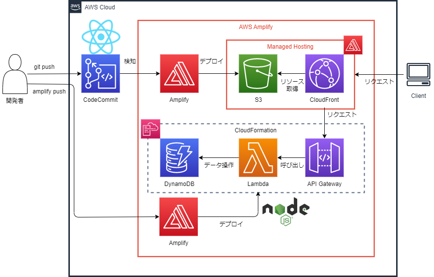

# フォルダ構成
```
.
├── README.md
├── amplify
│   ├── #current-cloud-backend
│   ├── README.md
│   ├── backend
│   │   ├── amplify-meta.json
│   │   ├── api
│   │   ├── awscloudformation
│   │   ├── backend-config.json
│   │   ├── function
│   │   │   └── hogehoge6faba366
│   │   ├── hosting
│   │   ├── tags.json
│   │   └── types
│   ├── cli.json
│   ├── hooks
│   └── team-provider-info.json
├── node_modules
├── package-lock.json
├── package.json
├── public
└── src
    ├── App.css
    ├── App.js
    ├── App.test.js
    ├── aws-exports.js
    ├── index.css
    ├── index.js
    ├── logo.svg
    ├── reportWebVitals.js
    ├── setupTests.js
    └── ui-components
```
- `README.md`：説明ファイル
- `amplify`：Amplify関連のファイル
- `amplify/backend/function`：Lambdaのソースファイル
- `node_modules`：Node.jsのライブラリ・パッケージ
- `package.json, package-lock.json`：Node.jsパッケージファイル
- `public`：静的ファイル
- `src`：Reactプロジェクト
- `src/ui-components`：Figmaから取り込んだコンポーネント

# 実行手順

## 1. Reactプロジェクトを作成する
- コマンド
```
npx create-react-app 【プロジェクト名】
cd 【プロジェクト名】
```
- 実行例
```
$ npx create-react-app 【プロジェクト名】
Need to install the following packages:
  create-react-app@5.0.1
Ok to proceed? (y) y
npm WARN deprecated tar@2.2.2: This version of tar is no longer supported, and will not receive security updates. Please upgrade asap.
...省略

Happy hacking!
$ cd 【プロジェクト名】
```

## 2. Amplify CLIのインストール
- コマンド
```
node -v
npm -v
sudo npm install -g @aws-amplify/cli
amplify -v
```
- 実行例
```
$ node -v
v18.12.1
$ npm -v
9.2.0
$ sudo npm install -g @aws-amplify/cli

changed 26 packages in 13s

7 packages are looking for funding
  run `npm fund` for details
$ amplify -v
10.6.2
```

## 3. AmplifyとAWSアカウントの紐づけを行う
- コマンド
```
amplify configure
```
- 実行例
```
$ amplify configure
Follow these steps to set up access to your AWS account:

Sign in to your AWS administrator account:
https://console.aws.amazon.com/
Press Enter to continue
```

1. AWSアカウントにサインインする
    - コマンド実行後、サインインページに遷移するのでサインインを行う
    - サインイン後、コンソールでEnterまたはリターンキーを押下する
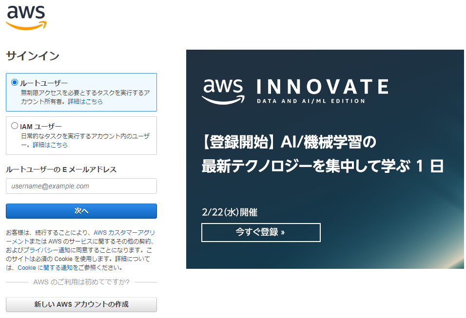
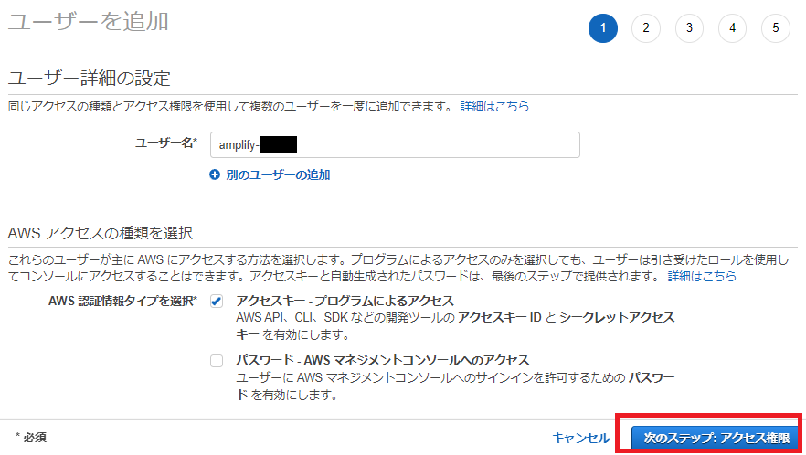
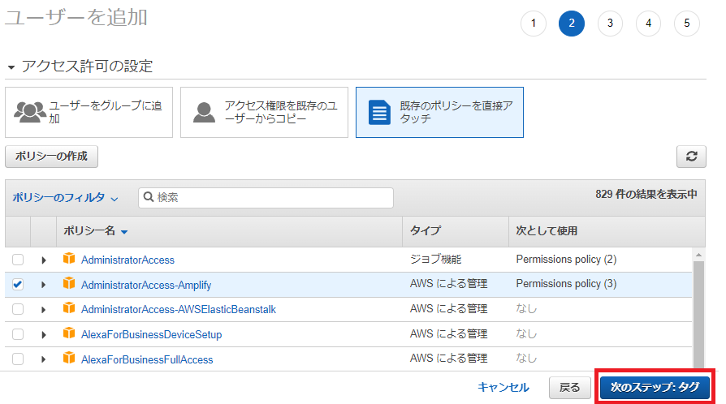
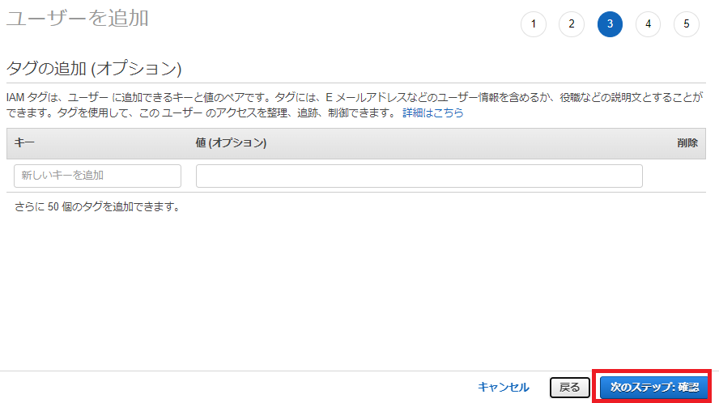
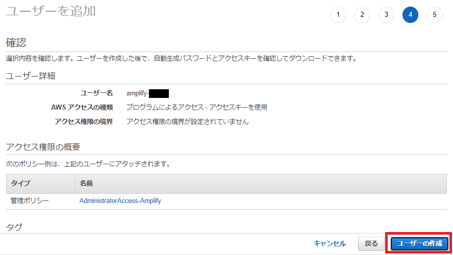
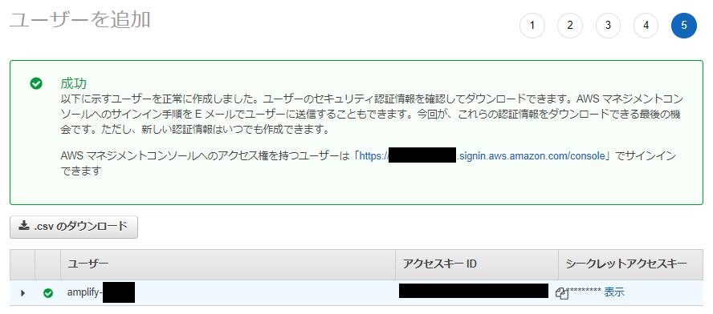

2. リージョンを選択
    - 十字キーで矢印が動くので選択したいリージョンに `❯` を合わせる
    - 選択後、コンソールでEnterまたはリターンキーを押下する
```
Specify the AWS Region
? region:
  eu-west-2
  eu-west-3
  eu-central-1
❯ 【リージョン】
  ap-northeast-2
  ap-southeast-1
  ap-southeast-2
```

3. IAMユーザ作成
    - コンソールに `amplify-XXXXX` が表示されたら、Enterまたはリターンキーを押下する
    - IAM作成画面に遷移するのでそのまま `次のステップへ` を押下する
    - アカウント作成後、`アクセスキー ID` と `シークレットアクセスキー` をメモする
    - アカウント作成後、コンソールでEnterまたはリターンキーを押下する
```
Specify the username of the new IAM user:
? user name:  (amplify-XXXXX)
```

4. `アクセスキー ID` と `シークレットアクセスキー` を入力する
    - `3. IAMユーザ作成` でメモした `アクセスキー ID` と `シークレットアクセスキー` を入力する
```
Enter the access key of the newly created user:
? accessKeyId:  ********************
? secretAccessKey:  ****************************************
```

5. プロファイル名を入力する
    - ここは任意
    - 普段のアクセスと分けるため、 `amplify` としておくと良いかも？
    - `プロファイル名` をメモする
```
This would update/create the AWS Profile in your local machine
? Profile Name:  amplify

Successfully set up the new user.
```

## 4. Amplify CLIの初期設定を行う
- コマンド
```
amplify init
```
- 実行例
```
$ amplify init
Note: It is recommended to run this command from the root of your app directory
? Enter a name for the project 【プロジェクト名】
The following configuration will be applied:

Project information
| Name: 【プロジェクト名】
| Environment: dev
| Default editor: Visual Studio Code
| App type: javascript
| Javascript framework: react
| Source Directory Path: src
| Distribution Directory Path: build
| Build Command: npm run-script build
| Start Command: npm run-script start

? Initialize the project with the above configuration? Yes
Using default provider  awscloudformation
? Select the authentication method you want to use: AWS profile

For more information on AWS Profiles, see:
https://docs.aws.amazon.com/cli/latest/userguide/cli-configure-profiles.html

? Please choose the profile you want to use 【プロファイル名】
Adding backend environment dev to AWS Amplify app: hogehoge

Deployment completed.
Deployed root stack 【プロジェクト名】 [ ======================================== ] 4/4
        AuthRole                       AWS::IAM::Role                 CREATE_COMPLETE
        UnauthRole                     AWS::IAM::Role                 CREATE_COMPLETE
        DeploymentBucket               AWS::S3::Bucket                CREATE_COMPLETE
        amplify-【プロジェクト名】-dev-hogehoge  AWS::CloudFormation::Stack     CREATE_COMPLETE

✔ Help improve Amplify CLI by sharing non sensitive configurations on failures (y/N) · no
Deployment state saved successfully.
✔ Initialized provider successfully.
✅ Initialized your environment successfully.

Your project has been successfully initialized and connected to the cloud!

Some next steps:
"amplify status" will show you what you've added already and if it's locally configured or deployed
"amplify add <category>" will allow you to add features like user login or a backend API
"amplify push" will build all your local backend resources and provision it in the cloud
"amplify console" to open the Amplify Console and view your project status
"amplify publish" will build all your local backend and frontend resources (if you have hosting category added) and provision it in the cloud

Pro tip:
Try "amplify add api" to create a backend API and then "amplify push" to deploy everything
```

1. プロジェクト名を入力する
    - ここは任意（変更なければ、そのままで良い）
    - Enterまたはリターンキーを押下する
```
Note: It is recommended to run this command from the root of your app directory
? Enter a name for the project (【プロジェクト名】)
```

2. プロジェクト構成の確認する
    - 構成に問題なければ、`y` 変更があれば、 `n` を入力して、Enterまたはリターンキーを押下する
```
Project information
| Name: 【プロジェクト名】
| Environment: dev
| Default editor: Visual Studio Code
| App type: javascript
| Javascript framework: react
| Source Directory Path: src
| Distribution Directory Path: build
| Build Command: npm run-script build
| Start Command: npm run-script start

? Initialize the project with the above configuration? (Y/n)
```

3. 認証方法を選択する
    - `AWS profile` を選択する
```
? Select the authentication method you want to use: (Use arrow keys)
❯ AWS profile
  AWS access keys
```

4. プロファイルを選択する
    - `3. AmplifyとAWSアカウントの紐づけを行う` で作成した `プロファイル名` を選択する
```
? Please choose the profile you want to use (Use arrow keys)
  default
❯ amplify
```

5. Amplify CLIに構成を共有するか
    - `n` と入力する
```
? Help improve Amplify CLI by sharing non sensitive configurations on failures (y/N)
```

## 5. Figmaでフロントエンドを作成する

1. Figmaにログインする
    - https://www.figma.com/login
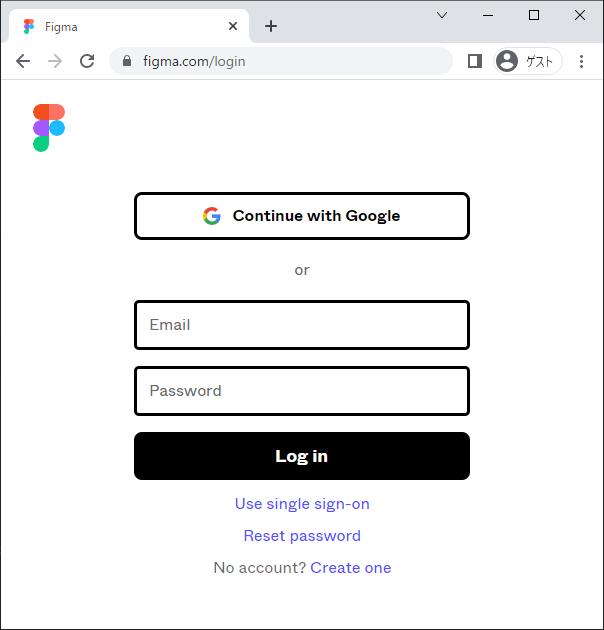

2. Figmaで `デザインファイルを新規作成` を押下する
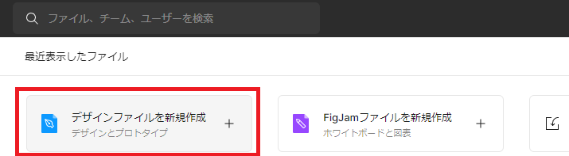

3. Figmaで画面デザインを作成し、 `共有` を押下する
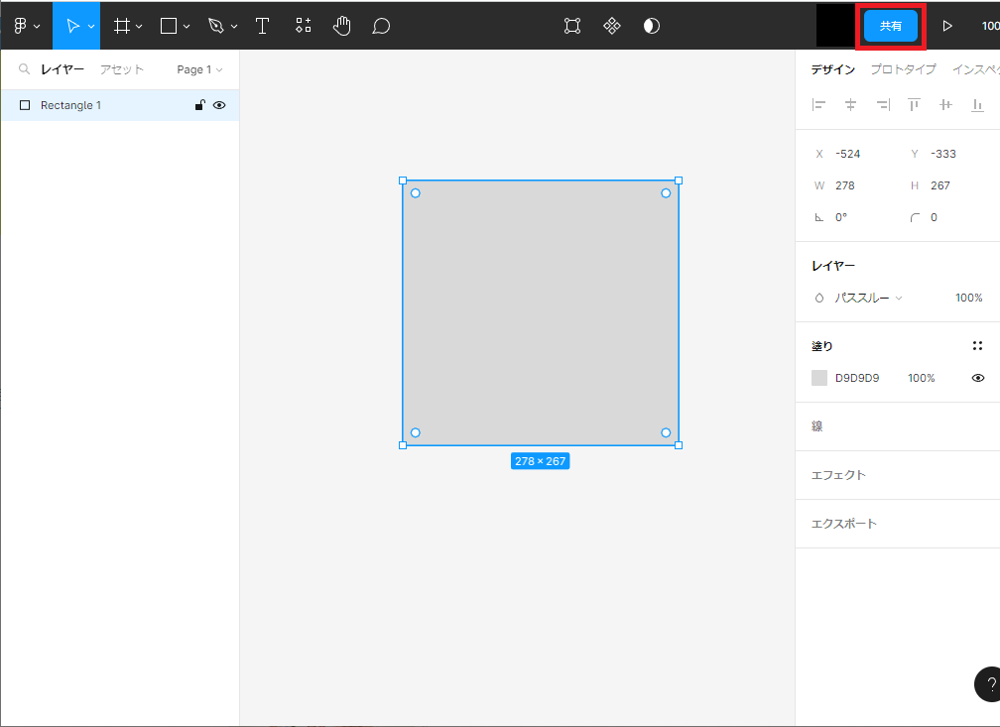

4. `リンクをコピーする` を押下する
    - `FigmaのURL` をメモする
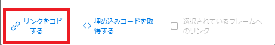

## 6. FigmaをAmplify Studioに取り込む
1. Amplifyマネジメントコンソール画面に遷移する
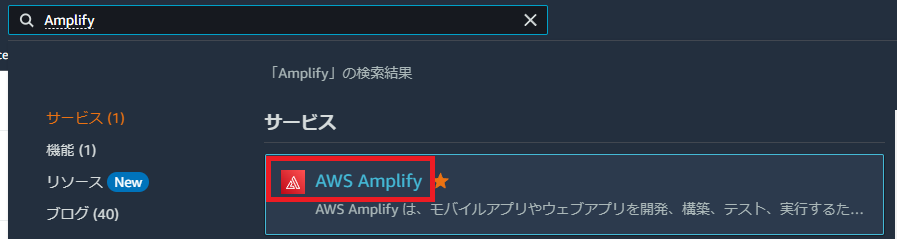

2. `【プロジェクト名】` のアプリを押下する
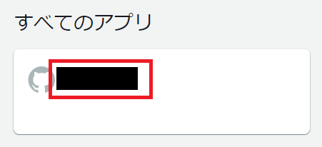

3. `Amplify Studioをセットアップ` を押下する
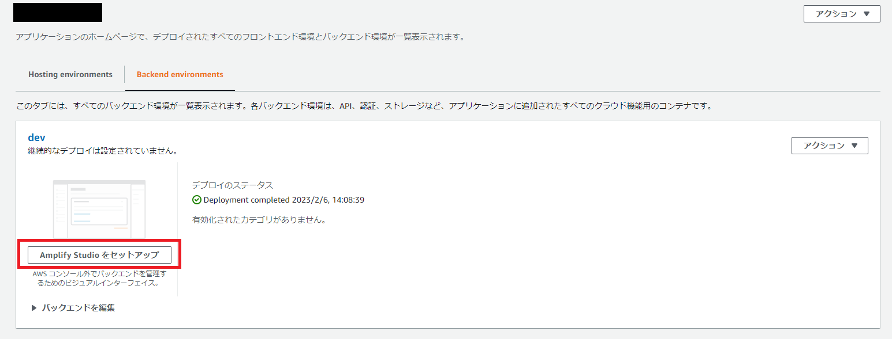

4. `Amplify Studio を有効にします。` をonにする
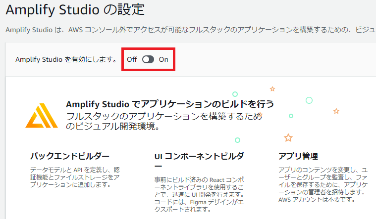

5. 前の画面に戻って `Studioを起動する` を押下する
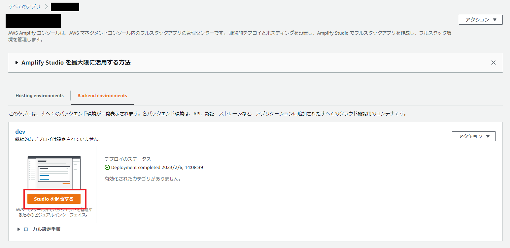

6. `UI Library > Sync with Figma` を押下する


7. `Paste your Figma file link` に `FigmaのURL` を入れて `Continue` を押下する
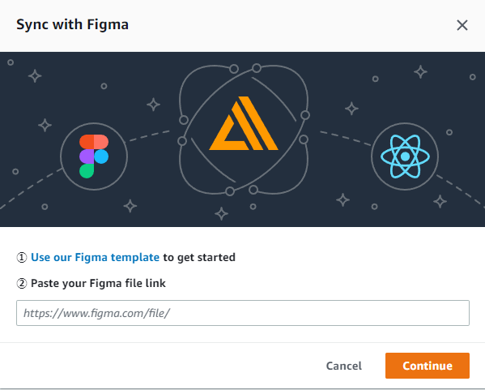

8. `Accept all` を押下する


9. `Components` にFigmaから取り込んだコンポーネントが追加されていることを確認する
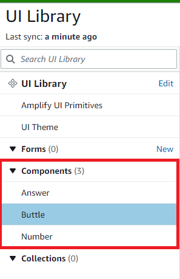

10. `Configure` を押下してコンポーネントの編集を行う
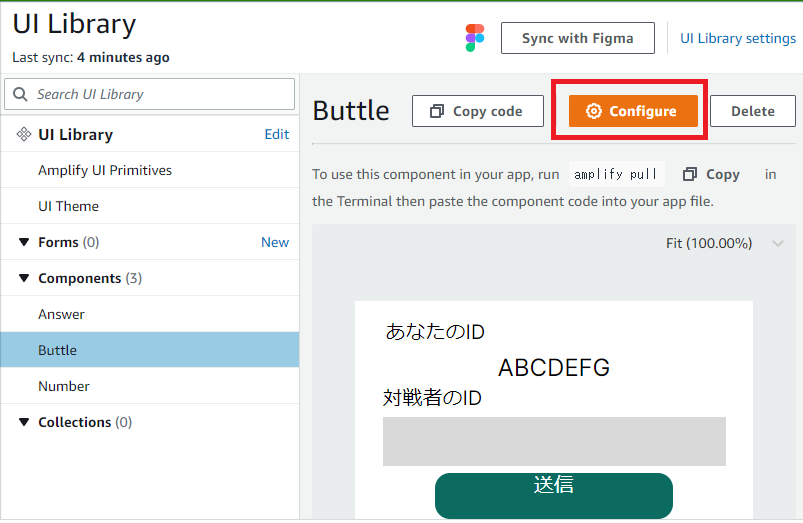

11.  `Set text label` や `Set onClick action` 、 `Convert to a slot` の設定を行う
    - `Set text label`：テキストを変数に置き換える
    - `Set onClick action`：クリック時のイベントを設定できる
    - `Convert to a slot`：要素を置き換える
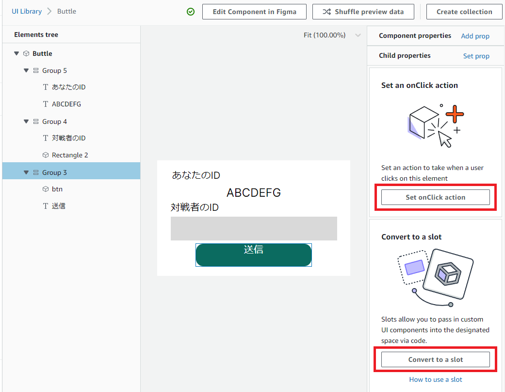

## 7. Amplify StudioをReactに変換してローカルで実行する
1. `</> Get component code` を押下する
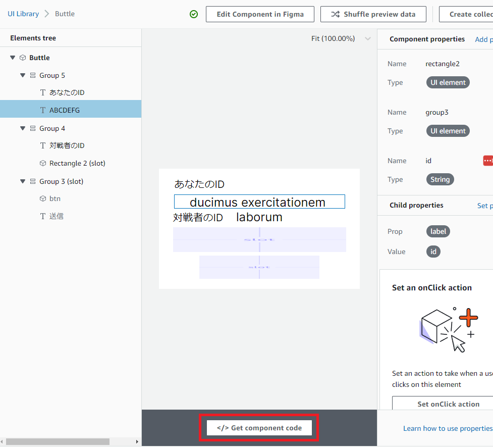

2. `Initial project setup` のコマンドを実行する
    - `1. Install npm dependencies, run the following command in Terminal:` に記載のコマンドを実行する
- コマンド
```
npm install aws-amplify @aws-amplify/ui-react
```
- 実行例
```
$ npm install aws-amplify @aws-amplify/ui-react
added 1327 packages, and audited 2798 packages in 1m

261 packages are looking for funding
  run `npm fund` for details

6 high severity vulnerabilities

To address all issues (including breaking changes), run:
  npm audit fix --force

Run `npm audit` for details.
```

3. `src/index.js` を変更する
    - `2. Configure Amplify by copying the code below into your index.js file:` と `3. Wrap your App in ThemeProvider:` の内容を `src/index.js`に反映する
- コード
```js:index.js
import React from 'react';
import ReactDOM from 'react-dom/client';
import './index.css';
import App from './App';
import reportWebVitals from './reportWebVitals';

import { ThemeProvider } from "@aws-amplify/ui-react";
import { Amplify } from 'aws-amplify';

import awsconfig from './aws-exports';

import "@aws-amplify/ui-react/styles.css";
import { studioTheme } from "./ui-components";

Amplify.configure(awsconfig);

const root = ReactDOM.createRoot(document.getElementById('root'));
root.render(
  <React.StrictMode>
    <ThemeProvider theme={studioTheme}>
      <App />
    </ThemeProvider>
  </React.StrictMode>
);

// If you want to start measuring performance in your app, pass a function
// to log results (for example: reportWebVitals(console.log))
// or send to an analytics endpoint. Learn more: https://bit.ly/CRA-vitals
reportWebVitals();
```

4. `Use this component` に記載のコマンドを実行する
    - `1. Pull in the latest components, run the following command in Terminal:` のコマンドを実行する
    - `ui-components` が作成されていることを確認する
- コマンド
```
amplify pull
ls src/
```
- 実行例
```
$ amplify pull

Pre-pull status:

    Current Environment: dev

┌──────────┬───────────────┬───────────┬─────────────────┐
│ Category │ Resource name │ Operation │ Provider plugin │
└──────────┴───────────────┴───────────┴─────────────────┘

✔ Successfully pulled backend environment dev from the cloud.
✅
✔ Synced UI components.
Post-pull status:

    Current Environment: dev

┌──────────┬───────────────┬───────────┬─────────────────┐
│ Category │ Resource name │ Operation │ Provider plugin │
└──────────┴───────────────┴───────────┴─────────────────┘
$ ls src/
App.css  App.test.js     index.css  logo.svg            setupTests.js
App.js   aws-exports.js  index.js   reportWebVitals.js  ui-components
```

5. `src/App.js` を変更する
    - `2. Import the component:` と `3. Render the component wherever you need it:` の内容を `src/App.js`に反映する
    - `【コンポーネント名】` には、 `ui-components` 内のjsxファイルの名前を入力する
- コード
```js:App.js
import './App.css';
import { 【コンポーネント名】 } from './ui-components';

function App() {
  return (
    <div className="App">
      <【コンポーネント名】 />
    </div>
  );
}

export default App;
```

6. ローカルで動作確認をする
    - 起動後、[localhost:3000](http://localhost:3000/) にアクセスする
    - 起動停止は `ctrl + c`
- コマンド
```
npm start
```
- 実行例
```
$ npm start
Compiled successfully!

You can now view hit-and-blow in the browser.

  Local:            http://localhost:3000
  On Your Network:  http://172.31.165.141:3000

Note that the development build is not optimized.
To create a production build, use npm run build.

webpack compiled successfully
```

## 8. AmplifyでCI/CDパイプラインを構築する
1. CodeCommitマネジメントコンソールにアクセスする
    - `HTTPSのクローン` をメモする
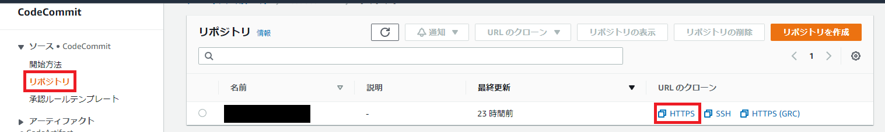

2. CodeCommitにpushする
    - `ユーザ名` と `パスワード` は [AWS CodeCommit の HTTPS Git 認証情報を生成](https://qiita.com/【ユーザ名】/items/066d2deea3e6fbe577ad) を参照
- コマンド
```
git add .
git commit -m "1st commit"
git remote add origin 【HTTPSのクローン】
git push -u origin master
or
git push -u origin main
```
- 実行例
```
$ git add .
$ git commit -m "1st commit"
[master 0760872] 1st commit
...省略
 create mode 100644 src/ui-components/studioTheme.js
 create mode 100644 src/ui-components/studioTheme.js.d.ts
$ git remote add origin https://git-codecommit.【リージョン】.amazonaws.com/v1/repos/【リポジトリ名】
$ git push -u origin master
Username for 'https://git-codecommit.【リージョン】.amazonaws.com': 【ユーザ名】
Password for 'https://codecommit-at-【アカウントID】@git-codecommit.【リージョン】.amazonaws.com':【パスワード】
Enumerating objects: 53, done.
Counting objects: 100% (53/53), done.
Delta compression using up to 12 threads
Compressing objects: 100% (50/50), done.
Writing objects: 100% (53/53), 275.90 KiB | 8.36 MiB/s, done.
Total 53 (delta 9), reused 0 (delta 0)
remote: Validating objects: 100%
To https://git-codecommit.【リージョン】.amazonaws.com/v1/repos/【リポジトリ名】
 * [new branch]      master -> master
Branch 'master' set up to track remote branch 'master' from 'origin'.
```

3. ホスティングを設定する
- コマンド
```
amplify add hosting
```
- 実行例
```
$ amplify add hosting
✔ Select the plugin module to execute · Hosting with Amplify Console (Managed hosting with custom domains, Continuous deployment)

? Choose a type Continuous deployment (Git-based deployments)
? Continuous deployment is configured in the Amplify Console. Please hit enter once you connect you
r repository
Amplify hosting urls:
┌──────────────┬──────────────────────────────────────────────┐
│ FrontEnd Env │ Domain                                       │
├──────────────┼──────────────────────────────────────────────┤
│ master       │ https://master.hogehoge.amplifyapp.com │
└──────────────┴──────────────────────────────────────────────┘
```

**3-1**
- `Hosting with Amplify Console (Managed hosting with custom domains, Continuous deployment)` を選択する
```
? Select the plugin module to execute …  (Use arrow keys or type to filter)
❯ Hosting with Amplify Console (Managed hosting with custom domains, Continuous deployment)
  Amazon CloudFront and S3
```

**3-2**
- `Continuous deployment (Git-based deployments)` を選択する
```
? Choose a type
❯ Continuous deployment (Git-based deployments)
  Manual deployment
  Learn more
```

**3-3**
- `Frontend enviroments > AWS CodeCommit` を選択し、`ブランチ接続` を押下する
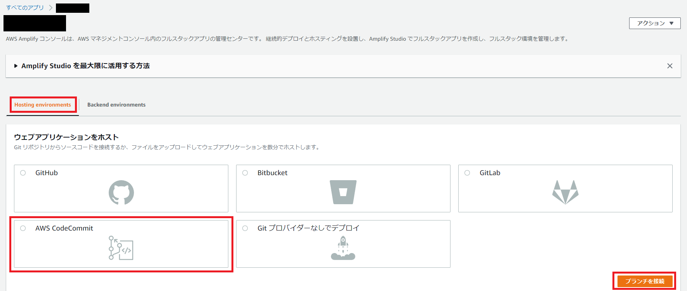

**3-4**
- リポジトリとブランチを選択し、 `次へ` を押下する
    - `最近更新されたリポジトリ`：【リポジトリ名】
      - 【リポジトリ名】は先ほどpushしたCodeCommitのリポジトリ
    - `ブランチ`：master または main
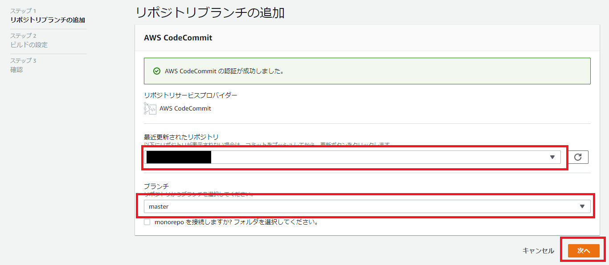

**3-4**
- 新しいサービスロールを作成する
    - `Environment`：dev
    - `フルスタック CI/CD を使用すると、あらゆるコードコミットでフロントエンドおよびバックエンドの変更を継続的にデプロイできます` にチェックを付ける
    - `新しいロールを作成` を押下する
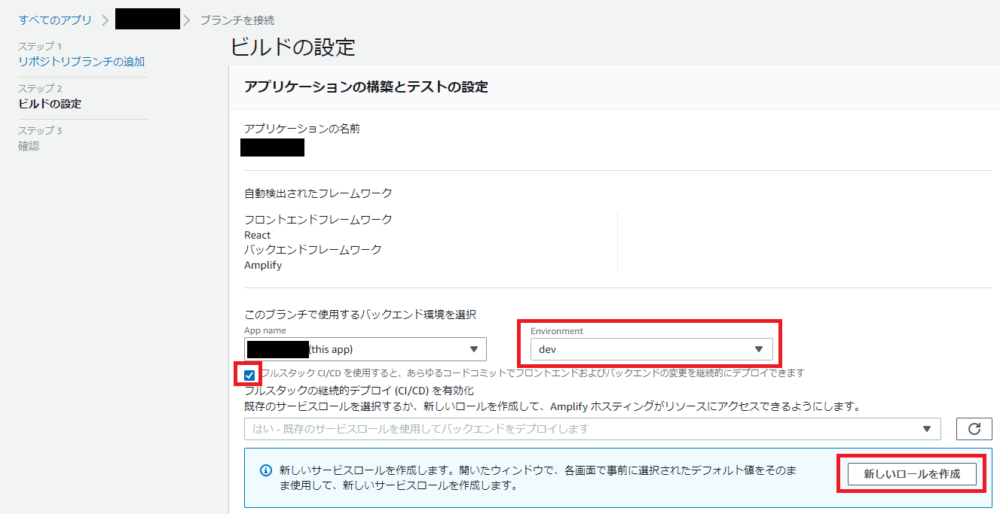

- `次のステップ：アクセス権限` を押下する
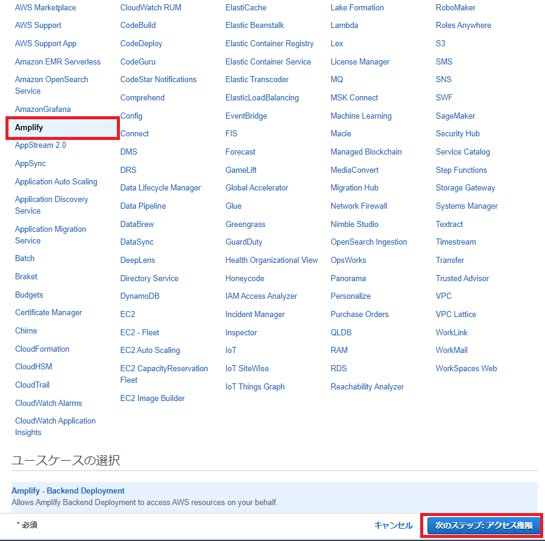

- `次のステップ：タグ` を押下する
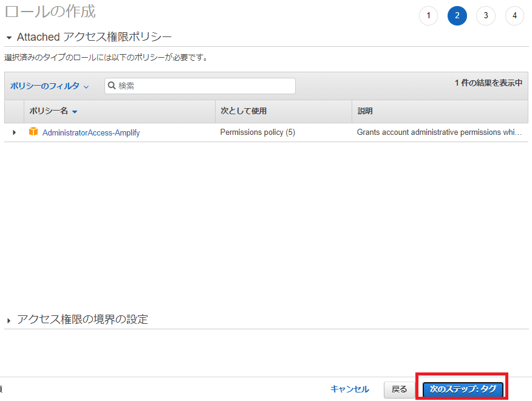

- `次のステップ：確認` を押下する
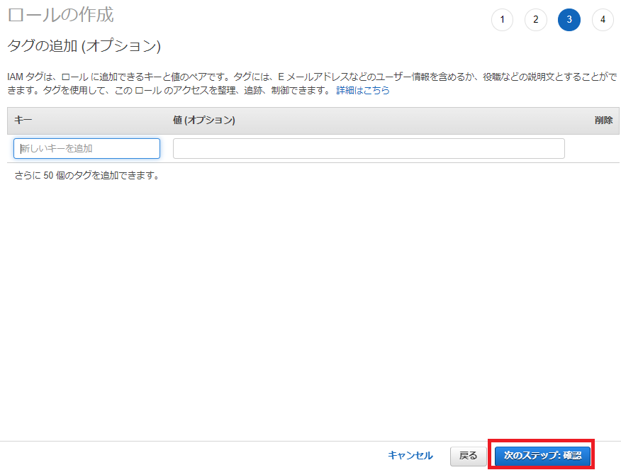

- `ロールの作成` を押下する
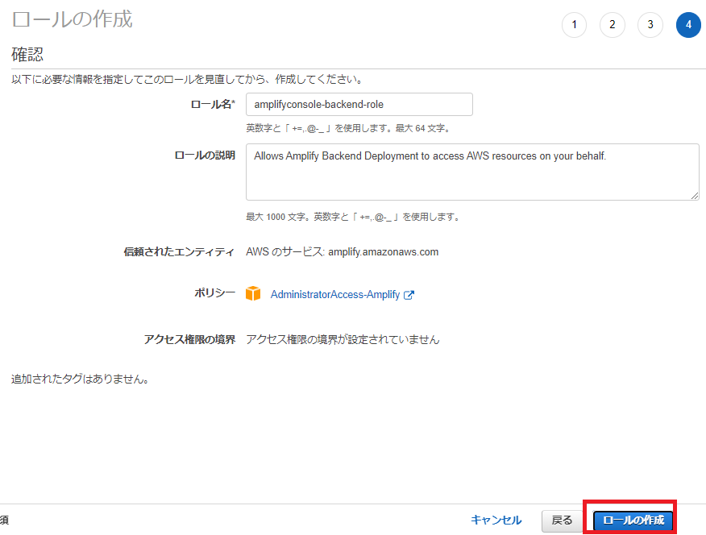

**3-5**
- サービスロールを選択し、 `次へ` を押下する
    - 更新ボタンを押下する
    - `amplifyconsole-backend-role` を選択する
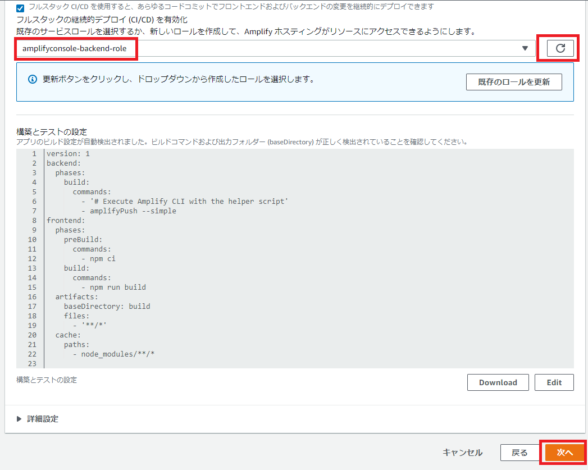

**3-6**
- `保存してデプロイ` を押下する
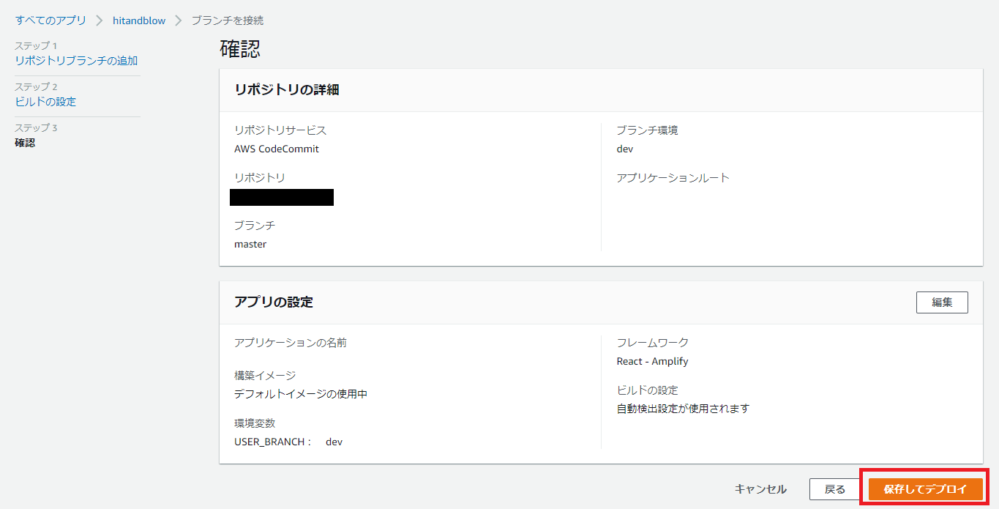

**3-7**
- デプロイが完了したことを確認する
    - 結構長いので根気強く待つ
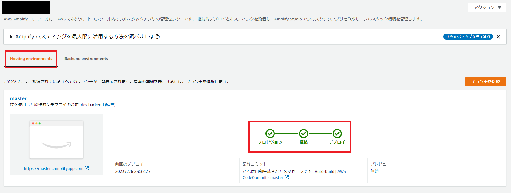
- コンソールで Enter または リターンキーを押下する
```
Amplify hosting urls:
┌──────────────┬──────────────────────────────────────────────┐
│ FrontEnd Env │ Domain                                       │
├──────────────┼──────────────────────────────────────────────┤
│ master       │ https://master.hogehoge.amplifyapp.com       │
└──────────────┴──────────────────────────────────────────────┘
```

## 9. Amplify CLIでAPIを作成する
1. Amplify CLIでREST APIをセットアップする
- コマンド
```
amplify add api
```
- 実行例
```
$ amplify add api

? Select from one of the below mentioned services: REST
✔ Provide a friendly name for your resource to be used as a label for this category in the project: · apicXXXXXXX

✔ Provide a path (e.g., /book/{isbn}): · /items
Only one option for [Choose a Lambda source]. Selecting [Create a new Lambda function].
? Provide an AWS Lambda function name: hogehoge6faba366
? Choose the runtime that you want to use: NodeJS
? Choose the function template that you want to use: Serverless ExpressJS function (Integration wit
h API Gateway)

Available advanced settings:
- Resource access permissions
- Scheduled recurring invocation
- Lambda layers configuration
- Environment variables configuration
- Secret values configuration

? Do you want to configure advanced settings? No
? Do you want to edit the local lambda function now? No
Successfully added resource hogehoge6faba366 locally.

Next steps:
Check out sample function code generated in <project-dir>/amplify/backend/function/hogehoge6faba366/src
"amplify function build" builds all of your functions currently in the project
"amplify mock function <functionName>" runs your function locally
To access AWS resources outside of this Amplify app, edit the /home/【ユーザ名】/AWS/amplify/hit-and-blow/amplify/backend/function/hogehoge6faba366/custom-policies.json
"amplify push" builds all of your local backend resources and provisions them in the cloud
"amplify publish" builds all of your local backend and front-end resources (if you added hosting category) and provisions them in the cloud
✅ Succesfully added the Lambda function locally
✔ Restrict API access? (Y/n) · no
✔ Do you want to add another path? (y/N) · no
✅ Successfully added resource apicXXXXXXX locally

✅ Some next steps:
"amplify push" will build all your local backend resources and provision it in the cloud
"amplify publish" will build all your local backend and frontend resources (if you have hosting category added) and provision it in the cloud
```

**1-1**
- APIの種類を選択する
    - `REST` を選択する
```
? Select from one of the below mentioned services:
  GraphQL
❯ REST
```

**1-2**
- API名を入力する
    - 任意
    - 特に指定がなければそのまま Enter または リターンキーを押下する
```
? Provide a friendly name for your resource to be used as a label for this category in the project: ‣ apicXXXXXXX
```

**1-3**
- APIのパスを入力する
    - 任意
    - 特に指定がなければそのまま Enter または リターンキーを押下する
```
? Provide a path (e.g., /book/{isbn}): ‣ /items
```

**1-4**
- Lambda関数名を入力する
    - 任意
    - 特に指定がなければそのまま Enter または リターンキーを押下する
```
? Provide an AWS Lambda function name: (hogehoge6faba366)
```

**1-5**
- プログラミング言語を選択する
    - 任意
    - 自分の好みのプログラミング言語を指定する
      - おすすめは `NodeJS`
```
? Choose the runtime that you want to use: (Use arrow keys)
  .NET 6
  Go
  Java
❯ NodeJS
  Python
```

**1-6**
- Lambda関数のテンプレートを選択する
    - `Serverless ExpressJS function (Integration with API Gateway)` を選択する
```
? Choose the function template that you want to use:
  AppSync - GraphQL API request (with IAM)
  CRUD function for DynamoDB (Integration with API Gateway)
  GraphQL Lambda Authorizer
  Hello World
  Lambda trigger
❯ Serverless ExpressJS function (Integration with API Gateway)
```

**1-7**
- 詳細設定の確認
    - `n` を入力する
    - 詳細設定を行う場合は、`y` を入力する
```
Available advanced settings:
- Resource access permissions
- Scheduled recurring invocation
- Lambda layers configuration
- Environment variables configuration
- Secret values configuration

? Do you want to configure advanced settings? (y/N)
```

**1-8**
- 今すぐローカルのLambdaを修正するかの確認
    - `n` を入力する
```
? Do you want to edit the local lambda function now? (Y/n)
```

**1-9**
- API アクセス制限の確認
    - `n` を入力する
```
Successfully added resource hogehoge6faba366 locally.

Next steps:
Check out sample function code generated in <project-dir>/amplify/backend/function/hogehoge6faba366/src
"amplify function build" builds all of your functions currently in the project
"amplify mock function <functionName>" runs your function locally
To access AWS resources outside of this Amplify app, edit the /home/【ユーザ名】/AWS/amplify/hit-and-blow/amplify/backend/function/hogehoge6faba366/custom-policies.json
"amplify push" builds all of your local backend resources and provisions them in the cloud
"amplify publish" builds all of your local backend and front-end resources (if you added hosting category) and provisions them in the cloud
✅ Succesfully added the Lambda function locally
? Restrict API access? (Y/n) ‣
```

**1-10**
- 2つめのAPIパスを作成するかの確認
    - `n` を入力する
```
? Do you want to add another path? (y/N) ‣
```

## 10. Amplify CLIでAPIをデプロイする
1. Amplifyの状態を確認する
- コマンド
```
amplify status
```
- 実行例
```
$ amplify status

    Current Environment: dev

┌──────────┬────────────────────┬───────────┬───────────────────┐
│ Category │ Resource name      │ Operation │ Provider plugin   │
├──────────┼────────────────────┼───────────┼───────────────────┤
│ Function │ hogehoge6faba366   │ Create    │ awscloudformation │
├──────────┼────────────────────┼───────────┼───────────────────┤
│ Api      │ apicXXXXXXX        │ Create    │ awscloudformation │
├──────────┼────────────────────┼───────────┼───────────────────┤
│ Hosting  │ amplifyhosting     │ Update    │                   │
└──────────┴────────────────────┴───────────┴───────────────────┘


Amplify hosting urls:
┌──────────────┬──────────────────────────────────────────────┐
│ FrontEnd Env │ Domain                                       │
├──────────────┼──────────────────────────────────────────────┤
│ master       │ https://master.hogehoge.amplifyapp.com       │
└──────────────┴──────────────────────────────────────────────┘
```

2. APIをデプロイする
    - `? Are you sure you want to continue? (Y/n)`：y
- コマンド
```
amplify push
```
- 実行例
```
$ amplify push
✔ Successfully pulled backend environment dev from the cloud.

    Current Environment: dev

┌──────────┬────────────────────┬───────────┬───────────────────┐
│ Category │ Resource name      │ Operation │ Provider plugin   │
├──────────┼────────────────────┼───────────┼───────────────────┤
│ Hosting  │ amplifyhosting     │ Create    │                   │
├──────────┼────────────────────┼───────────┼───────────────────┤
│ Function │ hogehoge6faba366   │ Create    │ awscloudformation │
├──────────┼────────────────────┼───────────┼───────────────────┤
│ Api      │ apicXXXXXXX        │ Create    │ awscloudformation │
└──────────┴────────────────────┴───────────┴───────────────────┘
? Are you sure you want to continue? Yes

Deployment completed.
Deploying root stack hogehoge [ ==============================---------- ] 3/4
        functionhogehoge6faba366       AWS::CloudFormation::Stack     CREATE_COMPLETE
        apiapicXXXXXXX                 AWS::CloudFormation::Stack     CREATE_COMPLETE
        amplify-hogehoge-dev-140839    AWS::CloudFormation::Stack     UPDATE_COMPLETE
Deployed function hogehoge6faba366 [ ======================================== ] 3/3
        LambdaExecutionRole            AWS::IAM::Role                 CREATE_COMPLETE
        LambdaFunction                 AWS::Lambda::Function          CREATE_COMPLETE
        lambdaexecutionpolicy          AWS::IAM::Policy               CREATE_COMPLETE
Deployed api apicXXXXXXX [ ======================================== ] 5/5
        apicXXXXXXX                    AWS::ApiGateway::RestApi       CREATE_COMPLETE
        functionhogehoge6faba366Per…   AWS::Lambda::Permission        CREATE_COMPLETE


REST API endpoint: https://hoeghoge.execute-api.【リージョン】.amazonaws.com/dev

✔ Synced UI components.
```

3. `REST API endpoint` にアクセスする
    - `success` が返ってくれば成功
- コマンド
```
curl https://hoeghoge.execute-api.【リージョン】.amazonaws.com/dev/items
```
- 実行例
```
$ curl https://hoeghoge.execute-api.【リージョン】.amazonaws.com/dev/items
{"success":"get call succeed!","url":"/items"}
```

## 11. Cognito認証を追加
1. 認証追加コマンド実行
- コマンド
```
amplify add auth
```
- 実行例
```
$ amplify add auth
Using service: Cognito, provided by: awscloudformation

 The current configured provider is Amazon Cognito.

 Do you want to use the default authentication and security configuration? Default configuration
 Warning: you will not be able to edit these selections.
 How do you want users to be able to sign in? Username
 Do you want to configure advanced settings? No, I am done.
✅ Successfully added auth resource hogehoge1a0728a5 locally

✅ Some next steps:
"amplify push" will build all your local backend resources and provision it in the cloud
"amplify publish" will build all your local backend and frontend resources (if you have hosting category added) and provision it in the cloud
```

**1-1**
- 認証方法を選択する
    - `Default configuration` を選択する
```
$ amplify add auth
Using service: Cognito, provided by: awscloudformation

 The current configured provider is Amazon Cognito.

 Do you want to use the default authentication and security configuration? (Use arrow keys)
❯ Default configuration
  Default configuration with Social Provider (Federation)
  Manual configuration
  I want to learn more.
```

**1-2**
- サインイン方法を選択する
    - `Username` を選択する
```
 How do you want users to be able to sign in? (Use arrow keys)
❯ Username
  Email
  Phone Number
  Email or Phone Number
  I want to learn more.
```

**1-3**
- 詳細設定を構成するか
    - `No, I am done.` を選択する
```
 Do you want to configure advanced settings? (Use arrow keys)
❯ No, I am done.
  Yes, I want to make some additional changes.
```

2. Amplifyに反映する
    - `? Are you sure you want to continue? (Y/n) `：y
- コマンド
```
amplify push
```
- 実行例
```
$ amplify push
⠧ Fetching updates to backend environment: dev from the cloud.✅ GraphQL schema compiled successfully.

Edit your schema at /home/ryome/AWS/amplify/hit-and-blow/amplify/backend/api/hogehoge/schema.graphql or place .graphql files in a directory at /home/ryome/AWS/amplify/hit-and-blow/amplify/backend/api/hogehoge/schema
✔ Successfully pulled backend environment dev from the cloud.

    Current Environment: dev

┌──────────┬────────────────────┬───────────┬───────────────────┐
│ Category │ Resource name      │ Operation │ Provider plugin   │
├──────────┼────────────────────┼───────────┼───────────────────┤
│ Auth     │ hogehoge1a0728a5   │ Create    │ awscloudformation │
├──────────┼────────────────────┼───────────┼───────────────────┤
│ Api      │ apicXXXXXXX        │ No Change │ awscloudformation │
├──────────┼────────────────────┼───────────┼───────────────────┤
│ Api      │ hogehoge           │ No Change │ awscloudformation │
├──────────┼────────────────────┼───────────┼───────────────────┤
│ Function │ hogehoge6faba366   │ No Change │ awscloudformation │
├──────────┼────────────────────┼───────────┼───────────────────┤
│ Hosting  │ amplifyhosting     │ No Change │                   │
└──────────┴────────────────────┴───────────┴───────────────────┘
? Are you sure you want to continue? Yes

Deployment completed.
Deploying root stack hogehoge [ =================================------- ] 5/6
        amplify-hogehoge-dev-140839    AWS::CloudFormation::Stack     UPDATE_COMPLETE
        apihogehoge                    AWS::CloudFormation::Stack     UPDATE_COMPLETE
        functionhogehoge6faba366       AWS::CloudFormation::Stack     UPDATE_COMPLETE
        authhogehoge1a0728a5           AWS::CloudFormation::Stack     CREATE_COMPLETE
        apiapicXXXXXXX                 AWS::CloudFormation::Stack     UPDATE_COMPLETE
Deployed auth hogehoge1a0728a5 [ ======================================== ] 10/10
        UserPool                       AWS::Cognito::UserPool         CREATE_COMPLETE
        UserPoolClient                 AWS::Cognito::UserPoolClient   CREATE_COMPLETE
        UserPoolClientWeb              AWS::Cognito::UserPoolClient   CREATE_COMPLETE
        UserPoolClientRole             AWS::IAM::Role                 CREATE_COMPLETE
        UserPoolClientLambda           AWS::Lambda::Function          CREATE_COMPLETE
        UserPoolClientLambdaPolicy     AWS::IAM::Policy               CREATE_COMPLETE
        UserPoolClientLogPolicy        AWS::IAM::Policy               CREATE_COMPLETE
        UserPoolClientInputs           Custom::LambdaCallout          CREATE_COMPLETE
        IdentityPool                   AWS::Cognito::IdentityPool     CREATE_COMPLETE
        IdentityPoolRoleMap            AWS::Cognito::IdentityPoolRol… CREATE_COMPLETE


GraphQL transformer version: 2

✔ Synced UI components.
```


# 参考文献
- https://tech.nri-net.com/entry/aws_serverless_static_website_hosting_using_amplify_overview
- https://qiita.com/narutaro/items/7aba191c12d917d36758
- https://www.techpit.jp/courses/185/curriculums/188/sections/1257/parts/5065
- https://blog.denet.co.jp/aws-amplify-aws-codecommit-ci-cd/
- https://dev.classmethod.jp/articles/amplify-congito-try-user-authentication/
- https://qiita.com/Junpei_Takagi/items/f2bc567761880471fd54


