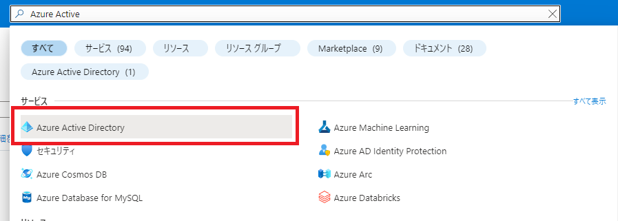
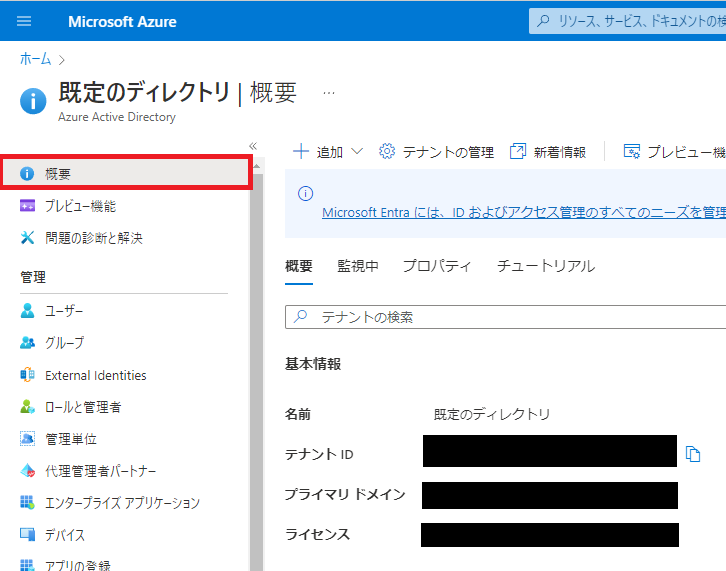
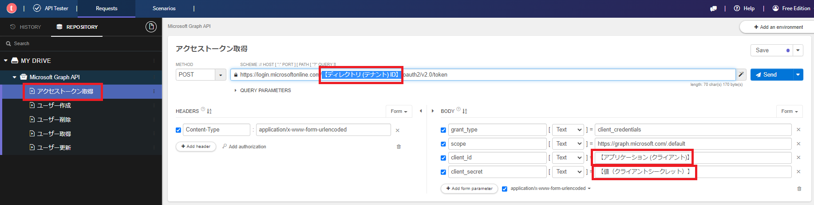

# 事前準備

1. Azureアカウントの作成を行う
    - https://azure.microsoft.com/ja-jp/free/active-directory/

2. Azure Active Directoryを開く
   - Microsoft Azure：https://portal.azure.com/

3. `概要` を開き、 `プライマリ ドメイン` をメモする

4. `アプリ登録 > 新規登録` を押下する

5. 必須項目を入力して `登録` を押下する
   - 名前：`任意`
   - サポートされているアカウントの種類：`この組織ディレクトリのみに含まれるアカウント`

6. `アプリケーション (クライアント)` と `ディレクトリ (テナント) ID` をメモする

7. `証明書とシークレット` を開き、`新しいクライアント シークレット` を押下する

8. 必須項目を入力して `追加` を押下する
   - 説明：`任意`
   - 有効期限：`任意`

9. `値（クライアントシークレット）` をメモする

10. `APIのアクセス許可` を開き、`アクセス許可の追加` を押下する

11.  `Microsoft Graph` を押下する

12.  `アプリケーションの許可` を選択し、`User.ReadWrite.All` にチェックを付けて、 `アクセス許可の追加` を押下する

13. `規定のディレクトリに管理者の同意を与えます` を押下する

14.  `はい` を押下する

15. 状態が `既定のディレクトリ に付与...` になっていれば成功


# Microsoft Graph APIをTalend API Testerで叩く

## アクセストークン取得

1. Google Chromeの拡張機能 Talend API Tester を開く
   - 持っていない人は [Talend API Tester](https://chrome.google.com/webstore/detail/talend-api-tester-free-ed/aejoelaoggembcahagimdiliamlcdmfm?hl=ja) を追加してください。

2. `Import > Import API Tester repository` を押下する

3. Microsoft_Graph_API.json を選択し、 `File` にチェックを付けて `Import` を押下する
   - [Microsoft_Graph_API.json](https://github.com/ryomeblog/qiita/tree/master/Microsoft%20Graph%20API%E3%81%A7%E3%83%A6%E3%83%BC%E3%82%B6%E3%81%AE%E5%8F%96%E5%BE%97%E3%83%BB%E4%BD%9C%E6%88%90%E3%83%BB%E6%9B%B4%E6%96%B0%E3%83%BB%E5%89%8A%E9%99%A4%E3%82%92%E3%81%99%E3%82%8B) は [GitHub](#github) に公開しています

1. `アクセストークン取得` を開き、[事前準備](#事前準備) でメモした `【ディレクトリ (テナント) ID】`、`【アプリケーション (クライアント)】`、`【値（クライアントシークレット）】` を置き換える

5. `Send` を押下して、200応答が返ってくれば成功

```json:レスポンス例
{
"token_type": "Bearer",
"expires_in": 3599,
"ext_expires_in": 3599,
"access_token": "hogehoge..."
}
```
6. `access_token` をメモする

## ユーザ作成

1. `ユーザ作成` を開き、 `【access_token】` と `【プライマリ ドメイン】` をメモした内容に置き換える
   - ※ `Bearer` と `【access_token】` の間には半角スペースがあること

2. `Send` を押下して、201応答が返ってくれば成功
```json:レスポンス例
{
"@odata.context": "https://graph.microsoft.com/v1.0/$metadata#users/$entity",
"id": "123hogehoge",
"businessPhones":[],
"displayName": "表示名",
"givenName": "名",
"jobTitle": "役職",
"mail": null,
"mobilePhone": null,
"officeLocation": "勤務先",
"preferredLanguage": null,
"surname": "姓",
"userPrincipalName": "test-user@【プライマリ ドメイン】"
}
```
3. `id` または `userPrincipalName` をメモする
4. `Azure Active Directory > ユーザ` にユーザが追加されていれば成功
   - https://portal.azure.com/#home


## ユーザ更新

1. `ユーザ更新` を開き、 `【access_token】` と `【id | userPrincipalName】` をメモした内容に置き換える
   - `【id | userPrincipalName】` は `id` または `userPrincipalName` どちらでも可
2. `Send` を押下して、204応答が返ってくれば成功
   - レスポンスはNo Content
3. `Azure Active Directory > ユーザ` のユーザが更新されていれば成功
   - https://portal.azure.com/#home


## ユーザ取得

1. `ユーザ取得` を開き、 `【access_token】` と `【id | userPrincipalName】` をメモした内容に置き換える
2. `Send` を押下して、200応答が返ってくれば成功
```json:レスポンス例
{
"@odata.context": "https://graph.microsoft.com/v1.0/$metadata#users/$entity",
"businessPhones":[],
"displayName": "更新",
"givenName": "名",
"jobTitle": "役職",
"mail": null,
"mobilePhone": null,
"officeLocation": "勤務先",
"preferredLanguage": null,
"surname": "姓",
"userPrincipalName": "test-user@【プライマリ ドメイン】",
"id": "123hogehoge"
}
```

※ `【id | userPrincipalName】` なしでAPI叩くとユーザ全取得になる


## ユーザ削除

1. `ユーザ取得` を開き、 `【access_token】` と `【id | userPrincipalName】` をメモした内容に置き換える
2. `Send` を押下して、204応答が返ってくれば成功
   - レスポンスはNo Content
3. `Azure Active Directory > ユーザ` のユーザが削除されていれば成功
   - https://portal.azure.com/#home

# GitHub

GitHubにソースコードを公開しています。

https://github.com/ryomeblog/qiita/tree/master/Microsoft%20Graph%20API%E3%81%A7%E3%83%A6%E3%83%BC%E3%82%B6%E3%81%AE%E5%8F%96%E5%BE%97%E3%83%BB%E4%BD%9C%E6%88%90%E3%83%BB%E6%9B%B4%E6%96%B0%E3%83%BB%E5%89%8A%E9%99%A4%E3%82%92%E3%81%99%E3%82%8B

# 参考文献

https://learn.microsoft.com/ja-jp/graph/api/resources/user?view=graph-rest-1.0

https://qiita.com/massie_g/items/fe7540161aa4a5f86bf5

https://qiita.com/kura_yu/items/cd2ebc1763a8923f3d7a

https://qiita.com/kura_yu/items/772d68498eb47de09cf8

